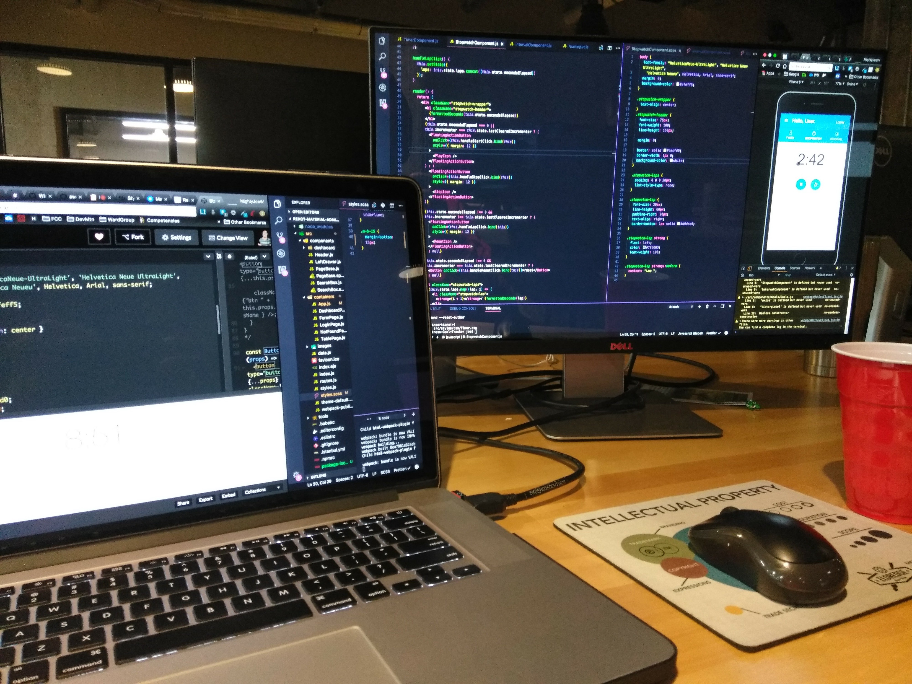
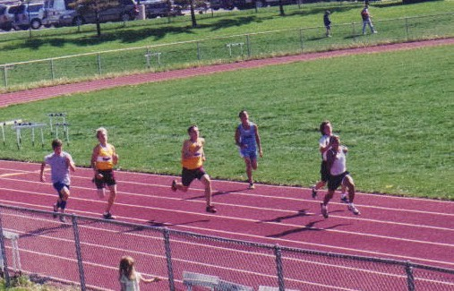
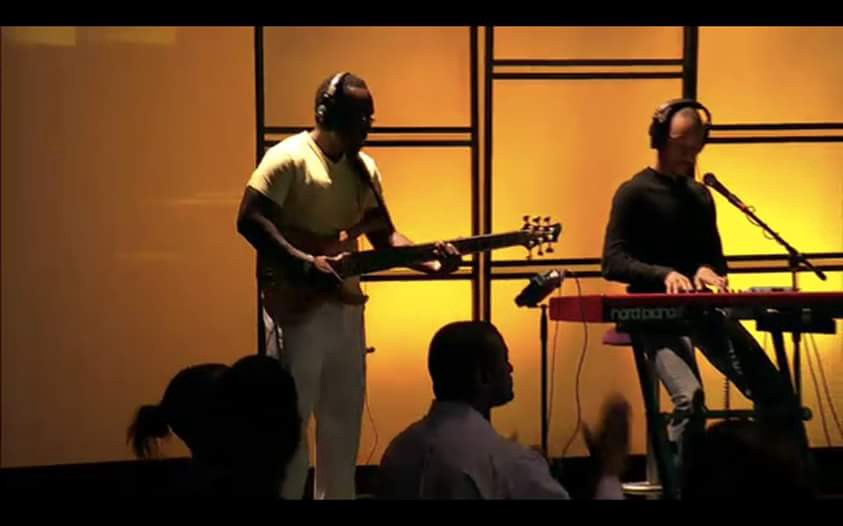
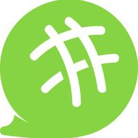
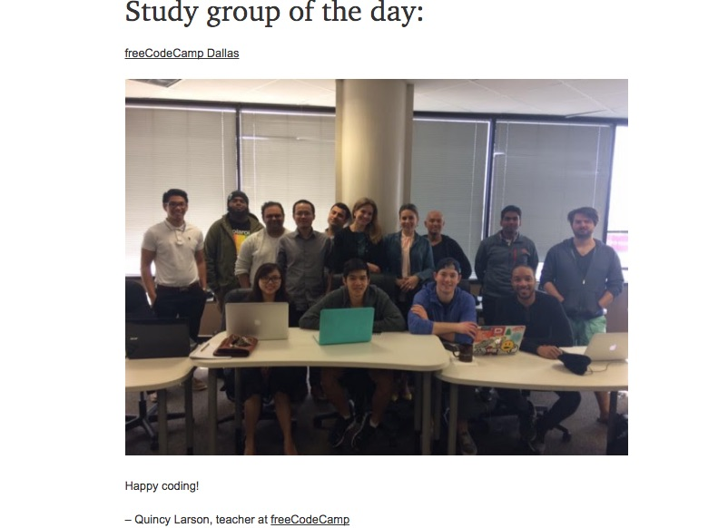
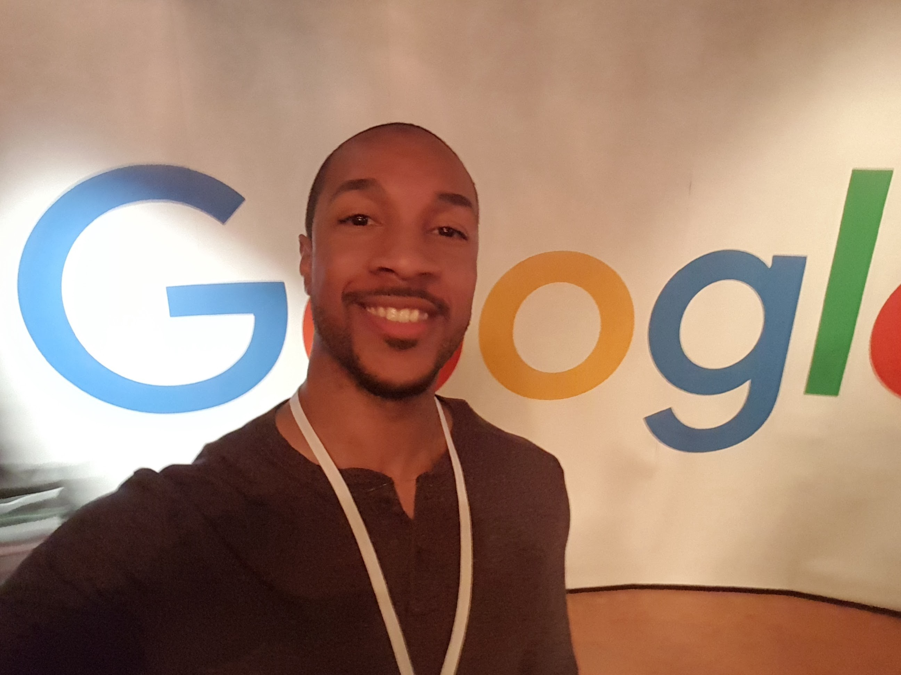
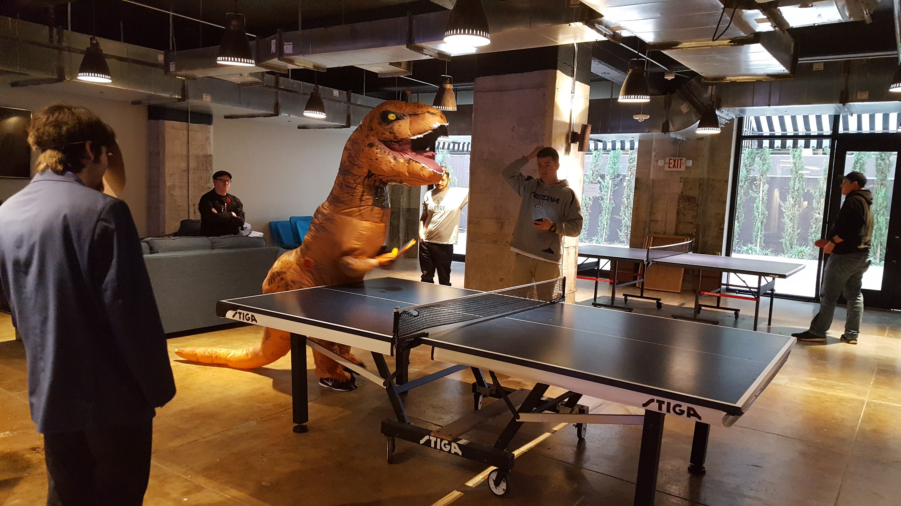

<figure>
  
  <figcaption style="text-align: center">My current setup at the hackerspace</figcaption>
</figure>

When going full speed, it can be difficult to pause and reflect on how far you’ve come and what all you’ve accomplished. My life changed unexpectedly on multiple occasions, and I found myself as an underutilized 20 something with no clue about what direction my life or career was headed.

It took awhile to get there but in 2017, I finally threw caution to the wind to pursue a new career as a software developer. Few things feel as frustrating as feeling purposeless or stagnant in life, so I hope that my journey to getScript(‘OrDieTryin’) will provide encouragement and motivation to anyone else experiencing a similar struggle.

###Background on What Led to this Change

Throughout my life, I was always very passionate about two things: athletics and music. Sports was my first love, and I dreamed like many others about competing on a professional level. At the very least, I was confident I’d be running track for a Division 1 university based on my natural speed and success each season.

<figure>
  
  <figcaption style="text-align: center">Photo from 1st place finish in 200m dash</figcaption>
</figure>

All of those plans changed overnight after sustaining an injury in football during my junior year of high school. My second passion, music, really took over from that point. From producing tracks to playing piano, I was laser focused on pursuing a career in music. I spent many years playing in bands (big and small), producing tracks for talents (including a few mainstream placements), and sharing tons of content online.

Over the years, though, that passion evaporated. Money from music was small to non-existent (with very demanding schedules). The most popular music was often the most explicit. Song lists were usually genres I didn’t enjoy listening to. I eventually got to the point where I was enjoying nothing about the process.

Meanwhile, I was working at a startup that was in a declining phase. Even if the startup was not declining, I would have still been in a support/admin role that I didn’t enjoy. The people and the service that the company provided were great, but I was not connected to my daily, tedious tasks.

In 2015, I tried many things on the side to reignite a spark such as running a YouTube channel, reviewing products for Gen.Video, and even attending the School of Video Game Audio’s online course. I may have even spread myself too thin during that phase as I was juggling those things with work and being a band leader at a church.

<figure>
  
  <figcaption style="text-align: center">2015 photo from a live set with band</figcaption>
</figure>

In 2016, I knew that I had to do something, <em>but I had no idea what I would do</em>. I spent a couple of months preparing for the GRE test even though I didn’t know what I wanted to go back to school for. I have a bachelor’s degree in business administration with a focus in marketing, but I didn’t envision myself going back to school for an MBA.

After taking the GRE in October of 2016, I spent a few weeks with my parents as my dad was preparing for surgery for colon cancer. It was a very scary time, and I’m beyond grateful everyday that my dad made a full recovery. The following week, I returned back home. It was December 2016, and I still had no clue what my next step would be but felt even more of a sense of urgency with doing something with my life.

Ironically, <strong>I had my epiphany while playing video games</strong>. I was playing Watch Dogs 2, an open-world action-adventure game where the main character is a hacker trying to take down the city’s advanced surveillance system. This was also not long after watching the first season of Mr. Robot.

I’ve always had an interest in tech, and these two things really sparked my interest in hacking. I wasn’t interested in any black-hat (illegal) hacking, but I was fascinated by what these characters were able to do with code. I also was always in awe of the concept of using code to build life-like, 3d gaming experiences like Watch Dogs 2.

I woke up the next morning and Googled tech events which led me to Meetup and Eventbrite. I RSVP’d to just about every upcoming tech event that I saw. My plan was to just immerse myself physically in this new world by going to live events throughout the city.

I attended my first freeCodeCamp meetup in late December of 2016 (along with many others), and it was there that I decided to focus on web development.

###100DaysOfCode

I kicked off 2017 doing the <a href="https://github.com/MightyJoeW/100-Days-of-Code" target="_blank" rel="noopener">```#100DaysOfCode```</a> challenge. This was extremely important as it forced me to code for at least an hour everyday. Since I was still working full-time (and spending time after work in the gym), I would have likely missed many days without this public declaration and record-keeping of my daily progress.

###Podcasts
<figure>
  
  <figcaption style="text-align: center">Code Newbie</figcaption>
</figure>

Podcasts almost completely replaced music for me for awhile. I started listening to <a href="https://www.programmingthrowdown.com/" target="_blank" rel="noopener">Programming Throwdown</a> and <a href="https://www.codenewbie.org/" target="_blank" rel="noopener">CodeNewbie</a> just about everyday. Programming Throwdown was great for hearing developers discuss topics such as programming languages and frameworks on a high level while CodeNewbie provided inspiration via success stories (oftentimes from career-changers). Over time, I continued to add more and more podcasts to my collection.

###Meetups and Conferences
Meetups may have been the most important aspect of my earlier days of learning. I was doing various courses online, but it was at meetups where I met other developers in the area and was able to learn in person.

<figure>
  
  <figcaption style="text-align: center">Image from freeCodeCamp Dallas meetup</figcaption>
</figure>

Some of the meetups had a class-like environment, some were big conferences, and others were networking events. All of them brought value in different ways, expanding my network and exposing me to new concepts and tools. I also attended my first hackathon and plan to attend more throughout 2018.

<figure>
  
  <figcaption style="text-align: center">Live at Google Sandbox Dallas</figcaption>
</figure>

###Coding Bootcamp
After learning as much as I could through the first half of 2017, I felt like I needed an extra (and intense) push. At two different meetups on consecutive days, I met and talked to two different people who both attended coding bootcamps and were working in positions that I wanted.

I was already considering doing a bootcamp, so talking to these two people helped a lot with finalizing my decision. I decided to go with DevMountain as they provide a full-time program and free housing to go along with a curriculum that focused on the stack that I wanted to learn. I resigned from my job in September of 2017 and did as much pre-course work as possible heading into my October 2017 start date.

<figure>
  
  <figcaption style="text-align: center">T-Rex playing ping-pong in DevMountain Lounge</figcaption>
</figure>

Deciding to pay $11,000 while giving up my income was <em>not</em> an easy decision to make (especially being married with a mortgage, student loans, and other bills). However, I looked at this as a short-term investment in our future that I badly wanted and needed to do to get to the next level.

Bootcamp has been incredibly fast-paced and overwhelming but I hung in there and worked hard everyday, even winning Best Presentation for my personal project. I am currently in my final 3 weeks, working to complete a group project (a <a href="https://github.com/FitTracker/Fitness-Goal-Tracker" target="_blank" rel="noopener">fit tracker app</a> that uses API’s to import and visualize data from multiple fitness apps including Fitbit and Strava).

###Writing and Blogging
With the end of my bootcamp quickly approaching, I finally decided to take the time to write my first Medium article. 5 things I would do differently if I could restart my coding bootcamp experience was published on December 11th, 2017 by codeburst.io.

I followed that up with a second article, How to Transform Your #100DaysOfCode Log Into a Visual Experience, which was published on December 20th, 2017 by freeCodeCamp.

I’ve also been working on solving various JavaScript algorithms on my (original) <a href="https://getscriptordietryin.wordpress.com/" target="_blank" rel="noopener">getScript(‘OrDieTryin’)</a> blog.

###Plans for 2018
2017 was a whirlwind, and I expect nothing less from 2018. Here are a few of the things I plan to focus on heading into 2018:

- Job hunting
- Preparing and giving tech talks
- Writing additional articles and blog posts
- Resume attending local freeCodeCamp Meetup and help facilitate and teach classes

My story will be different from yours, but I hope that something in here can encourage you to keep fighting and moving forward. If you don’t know what you want to do, try to remain optimistic and put yourself in environments to be exposed to new things and people (search on Meetup for things you are interested in).

If you maybe feel too old to pursue something new, I’ve met and seen stories from many people who are so happy to have pursued a new career later in life. No matter what, keep moving forward and work hard!

<em>If you have any thoughts, comments or questions, feel free to comment below or <a href="https://www.linkedin.com/in/josephmwarren/" target="_blank" rel="noopener">connect with me on LinkedIn.</a></em>