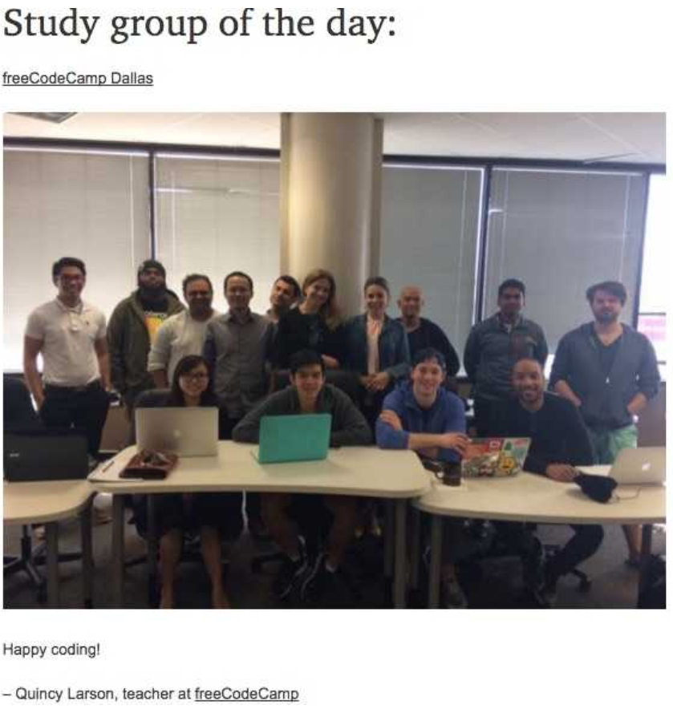
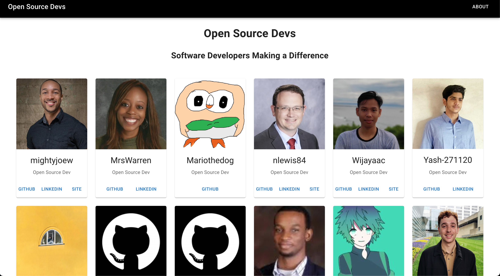
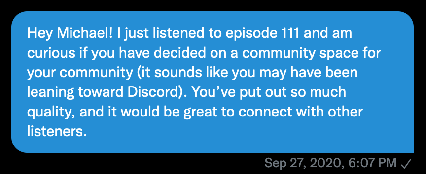
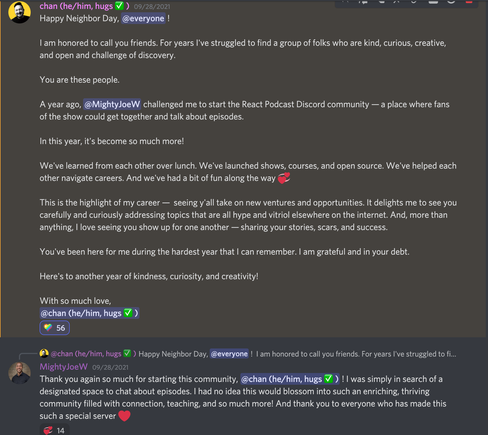

<figure>
  
  <figcaption style="text-align: center">Photographer: <a href="https://unsplash.com/@brett_jordan" target="_blank" rel="noopener noreferrer">Brett Jordan
</a></figcaption>
</figure>

For far too long, programming carried the stereotype of being an isolated process in which introverted, socially-awkward computer guys hack away in their basement.

<figure style="text-align: center">
  
</figure>

On the contrary, software development is a process which flourishes when done in community. From newcomers trying to learn the ropes to open-source collaborations to professionals working closely with designers and business personnel, community is the heartbeat of creating useful technology. Here are 5 specific benefits for software developers to consier throughout their careers.

## Community provides direction and stability

Embarking on a career in software development can feel like attempting to navigate a forest with a completely different directional guide stapled to each tree. The internet is loaded with helpful resources for learning how to code, but it’s unclear where exactly to begin, what information is relevant, and whether or not you should stick with whichever language or learning resource you chose.

My initial attempt to learn how to code in 2014 was a failure. Inspired by the mind-boggling technical feats in Watch Dogs, Ubisoft’s open-world action-adventure game about hackers, I started Googling about hacking until I stumbled upon on a Codecademy Python course. I didn’t know anyone in this space to direct me on if Python was relevant or how it’s actually used in a professional environment, but I continued working through the course until I eventually got stuck on a lesson. Confused on how to proceed and unsure if this was even what I should be learning, I gave up.

When Watch Dogs 2 was released in 2016, it reignited my interest in learning how to code. This time around, though, I took a completely different approach. I refused to repeat my mistake from a few years ago. I Googled "coding events near me" and RSVP’d to every upcoming event I could find. This resulted in me regularly attending meetups by groups including freeCodeCamp, Node School, Open Coffe Club, <a href="https://www.meetup.com/ReactJSDallas/" target="_blank" rel="noopener noreferrer">ReactJS Dallas
</a>, and Women Who Code (I messaged them ahead of time asking if men could attend &#128517;).

freeCodeCamp Dallas was vital to my career transition as the weekly meetups provided clear direction. The instructors gave me advice on where to start, what to focus on, and taught different lessons each week. This put me on a path to learn HTML, CSS, and JavaScript in my pursuit of frontend development knowledge.

<figure>
  
</figure>

Without any kind of communal support, you have no one to advise you on what the best resources are for what you’re wanting to do or to explain what a job you're pursuing actually entails.

## Community provides help when you need it

In addition to being able to get guidance and insight from real people about where to begin and what professionals are actually using, community can provide help for whichever issues you run into along the way.

When I got stuck on the Python course, I had no idea how to progress. I didn’t know what I was doing wrong, and I didn’t know anyone in this space to reach out to for help. I wasn’t aware of any online coding communities at the time, so I came to the conclusion that coding was not for me. <strong>Working in isolation will prevent you from experiencing breakthroughs that come along with learning in community.</strong>

Something to note is that there are different levels of intimacy with communities. Communities such as GitHub and Stack Overflow are spaces where developers are regularly posting questions and answers to real problems. These kind of communities can feel more anonymous at times but are great places for getting answers.

Other communities have dedicated spaces on platforms such as Slack and Discord where you are able to get to know the people in those spaces over time. While attending freeCodeCamp Dallas, I met new people each week and made friends over time who I was able to reach out to in the Slack group whenever I had questions. There was no longer extended periods of time where I felt stuck and helpless. Similarly, after completing DevMountain’s web development bootcamp in 2018, I had continued access to my mentors and cohort-mates via our Slack channel.

## Community provides motivation and encouragement

We as humans tend to take on the identity of the people we are around the most. If you are around people that are exercising and eating right every day, there is a great chance that you’ll eventually find yourself in the gym with them or eating better when around them. The same goes for coding. If you are immersed in an environment with other coders, you’ll absorb that energy and discipline required to overcome the technical obstacles that appear throughout the process.

Alex Kallaway’s <a href="https://www.100daysofcode.com/" target="_blank" rel="noopener noreferrer">#100DaysOfCode
</a> challenge provided me with a steady flow of motivation and encouragement. By posting daily progress on Twitter over a 100-day period, I received a lot of positive feedback and interactions from the tweets. It also was motivating to see what everyone else was doing each day for the challenge. Like working out at the gym, I tend to produce a higher quality workout when I can see people all around me putting in work.

I’d highly recommend giving #100DaysOfCode a shot if you are looking for an encouraging community and/or if you are trying to establish a consistent daily routine of coding. For tips on how to make your #100DaysOfCode log an engaging visual experience, check out my article <a href="https://www.getscriptordietryin.com/How-to-Transform-Your-100DaysOfCode-Log-Into-a-Visual-Experience/" target="_blank" rel="noopener noreferrer">How to Transform Your 100DaysOfCode Log Into a Visual Experience
</a>.

Similar to Quicy Larson's <a href="https://www.freecodecamp.org/" target="_blank" rel="noopener noreferrer">freeCodeCamp
</a> and Alex Kallaway’s #100DaysOfCode, Saron Yitbarek created an unbelievably welcoming and engaging community in <a href="https://www.codenewbie.org/" target="_blank" rel="noopener noreferrer">CodeNewbie
</a> (which is now owned by <a href="https://dev.to/" target="_blank" rel="noopener noreferrer">DEV
</a>).

## Community builds your network

Netoworking sometimes carries a negative connotation as the thought of introducing yourself to strangers with some elevator pitch can induce anxiety, so I’ll emphasize making friends in this space instead. Dictionary.com defines networking as "the action or process of interacting with others to exchange information and develop professional or social contacts." This happens naturally as you begin attending events (online or virtual) and participating in communities. Making aquantances and friends over time strengthens the likelihood that you’ll be recommended for opportunities in the future. It also expands the pool of people you can personally reach out to whether you’re looking for an opportunity for yourself or looking for talent to fill a role.

My network grew organically as I continued to attend meetups and participate in different communities. When attending the ReactJS Dallas meetups in 2017, I dreamed about interning at the company that hosts the meetups, Text-Em-All (a mass text messaging/automated calling company and creator of Material-UI). I put myself out there to get to know the organizer over time and positioned myself to have a better chance at landed the internship in after completing my web development bootcamp 2018. Checkout the following video for more details on how I curated the relationship over time and landed the internship.

<iframe width="560" height="315" src="https://www.youtube.com/embed/HuumGRGpYDo" title="YouTube video player" frameborder="0" allow="accelerometer; autoplay; clipboard-write; encrypted-media; gyroscope; picture-in-picture" allowfullscreen></iframe>

After completing the #100DaysOfCode challenge, I messaged Alex Kallaway on Twitter about the visual log I created. He was excited about the log and decided to share the article on the #100DaysOfCode resources page https://www.100daysofcode.com/resources/. Making a contribution in his community led to a personal connection with him, and the posting of my article on his site led to more connections with developers around the world.

If you’re an introvert, I understand if this sounds intimidating. However, there are ways to ease into networking as an introvert. For example, when you attend virtual meetups, you can keep your camera off until you’re comfortable showing your face (which may not be that day). Also, you can utilize the chat if you’re uncomfortable speaking to a group. Dropping your LinkedIn in the chat can lead to even one connection that can grow into a rich friendship and career ally over time.

## Community is an opportunity multiplier

Opportunities come from people, so you need to know actual people to increase the opportunities that will come your way. Opportunities include jobs, projects, speaking engagements, collaboration efforts, traveling, etc.

Prior to landing my fulltime role, I often heard that many of the best jobs either weren’t posted publicly or were posted publicly with an internal candidate already in mind. This can feel discouraging, but all hope is not lost. Professionals regularly attend meetups, and you can build relationships with them in those meetups or online communities. Being in that community can provide job insight about specific companies that you just won’t find while searching online yourself.

As <a href="https://hacktoberfest.digitalocean.com/" target="_blank" rel="noopener noreferrer">Hacktoberfest
</a> rolls on, building within a community provides benefits including showcasing your skills publicly, working in a team environment, learning from others’ code reviews & pull requests, contributing to enhancing projects, creating additional resume content, and leaving an impact on actual people who may be in a position to recommend you for an opportunity in the future.

For #Hacktoberfest2021, I created the <a href="https://github.com/MightyJoeW/OpenSourceDevs" target="_blank" rel="noopener noreferrer">Open Souce Devs</a> project for newcomers to learn how to contribute to open-source. Within the first week, the project received contributions from 16 different developers! Each contributor on the project is able to collaborate and has access to a collection of global developers that can potentially help them with other projects or provide job leads.

<figure>
  
  <figcaption style="text-align: center"><a href="https://opensourcedevs.com/" target="_blank" rel="noopener noreferrer">Open Source Devs homepage
</a></figcaption>
</figure>

In regards to the aforementioned ReactJS Dallas meetup, growing with that community positioned me to become a co-organizer for the meetup in 2020. This has also had a multiplier effect as I’ve been able to engage more directly with each month’s speakers, building personal relationships with talented developers throughout the metroplex.

Another awesome community-related endeavor is the <a href="https://discord.gg/QyCJzsEV" target="_blank" rel="noopener noreferrer">React Podcast discord</a>. I decided to reach out to the host Michael Chan to ask if he had decided on a community space for his listeners to connect and discuss episodes.

<figure>
  
</figure>

Michael made it happen, and the React Podcast server exploded into a thriving community of 817 members and counting, loaded with lively discussions, episode listen-parties, lunch learning sessions, collaborative projects, career advice, and special appearances by industry leaders including <a href="https://twitter.com/cassidoo" target="_blank" rel="noopener noreferrer">@cassidoo
</a>, <a href="https://twitter.com/ryanflorence" target="_blank" rel="noopener noreferrer">@ryanflorence
</a>, and <a href="https://twitter.com/kentcdodds" target="_blank" rel="noopener noreferrer">@kentcdodds
</a>.

<figure>
  
</figure>

Community is the secret sauce that can bullet-proof your software development career. We are stronger together than we are alone, and healthy communities help to unlock your full potential while positioning you to help others along the way as well.

<em>Looking for a healthy community of coders? Leave a comment below or <a href="https://www.linkedin.com/in/josephmwarren/" target="_blank" rel="noopener noreferrer">connect with me on LinkedIn</a>!</em>
