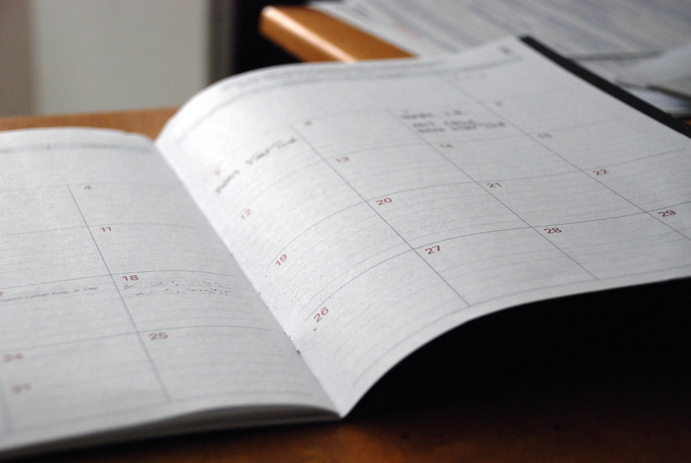

<figure>
  
  <figcaption style="text-align: center">Photographer: <a href="https://unsplash.com/@janesky" target="_blank" rel="noopener noreferrer">Antonio Janeski</a></figcaption>
</figure>

Software development can be easily mistaken as a purely technical process of turning code into beautiful, fully-interactive digital experiences.

Although technical abilities are at the core of building software, there are many non-technical skills that directly impact one's ability to thrive in this space. These "soft skills" are not taught in school or tutorials but are paramount in a developer's daily productivity and long-term career growth.

##Context Switching

<figure>
  
  <figcaption style="text-align: center">Photographer: <a href="https://unsplash.com/@freestocks" target="_blank" rel="noopener noreferrer">freestocks</a></figcaption>
</figure>

If you enjoy multitasking or jumping in and out of different conversations & meetings, you’ll feel right at home working with a team or in a fast-paced environment. If you don’t like to have your flow state broken while working, it’s crucial to have processes in place to keep your productivity from dropping whenever you have to context switch.

In a perfect world, I would have the luxury of finishing one task before moving onto another or joining a meeting about unrelated work. Because this is oftentimes not possible, I had to find ways to preserve my flow state and to reduce the amount of time it takes to get back up to speed on what I was previously working on. The following methods have been beneficial to my productivity:

- Block off a chunk of time on your calendar each day that will be solely focused on a specific task. If you aren’t able to reserve a do-not-disturb block during your usual work hours, experiment with a block of time that is earlier or later than when your team is online and active.
- Keep notes as you are working through a problem. It’s amazing how lost you can feel when returning to a problem after being pulled away from it.
- Find out if you are really needed in meetings. This is not a license to skip meetings, but an attempt to utilize your time more effectively when possible.
- Delegate and automate when possible. If you have too much on your plate, find out how your teammates can help with the workload. In regards to automating, identify tasks that you do repeatedly and see if there is an opportunity to automate the process. For example, <a href="https://git-scm.com/book/en/v2/Git-Basics-Git-Aliases" target="_blank" rel="noopener noreferrer">git aliases</a> and text expanders allow you to create shortcuts for commands and text you regularly type.

##Estimating Dates of Completion

<figure>
  
  <figcaption style="text-align: center">Photographer: <a href="https://unsplash.com/@erothermel" target="_blank" rel="noopener noreferrer">Eric Rothermel</a></figcaption>
</figure>

Estimating how long a task will take is about as tricky of an endeavor as I’ve encountered. Speaking speficially as a developer in an agile environment, each story (unit of work) is given a certain number of points to represent the estimated effort it will take to complete. If you work in time-based sprints, it’s expected that you’ll complete the work you agreed to within that time frame (work can carry over, but it’s desired to improve your estimates so the team can do a better job at planning future work).

It can be natural to believe that stories can be completed relatively quickly. However, there are many factors and variables that affect your timelines including the following:

- The implementation of the feature is more technically challenging than anticipated
- Discovering missing acceptance criteria or business requirements creates more work for a story
- You may spend more time than expected writing tests
- QA (Quality Assurance) may run into issues while testing your code or find defects that require your attention
- You didn’t have as much dev time as you anticipated as you may need to attend meetings, engage in planning sessions, help teammates, review code, complete trainings, etc.
- You and your teammates will have planned and unplanned days off as life happens, decreasing the hours you can dedicate to working on your stories

If you’re early on in your coding journey, try estimating how long small tasks on a current project will take to complete. When finished, compare your actual effort to what you predicted. You may be surprised at the difference.

Lastly, think twice before choosing a new technology for work that has a deadline. Desiring to utilize more modern techniques in React, I chose to use hooks and React Testing Library on a new project (which had a deadline). I had a high level understanding of both at the time, but I realized about half way through how much I needed to learn about both to write effective code. This absolutely added to my initial estimates, leading to multiple late nights and headaches.

##Providing Non-Technical Explanations

<figure>
  
  <figcaption style="text-align: center">Photographer: <a href="https://unsplash.com/@anotherleaf" target="_blank" rel="noopener noreferrer">Chris Arthur-Collins</a></figcaption>
</figure>

Providing non-technical explanations sounds simple, but there is an art to it. When you’re in the deep end on a specific problem, it feels very natural to provide a detailed update whenever you come up for air. The problem is you may be providing information that is not useful depending on your audience.

Let’s take a look at how this plays out. I previously mentioned working in an agile environment. Daily scrum stand ups (quick meetings) include non-dev teammates such as scrum masters and product owners. If you want to give an update about how you’re fixing an issue with state, your scrum master probably won’t know the difference between context api and Redux. If talking to a designer about a design comp, you'll want to provide input with a focus on what's visible on the UI (user interface) verses diving into the functions and loops under the surface.

Know your audience when giving updates, and strive to speak accordingly. If you’re not in a technical meeting, try to focus on what problem you’re solving without diving too deeply into the technical details.

##Understanding The Big Picture

<figure>
  
  <figcaption style="text-align: center">Photographer: <a href="https://unsplash.com/@markusspiske" target="_blank" rel="noopener noreferrer">Markus Spiske</a></figcaption>
</figure>

Building anything useful with code is a complicated endeavor with a lot of moving parts. Digital products require a user interface for people to interact with, a database to store the data, business requirements to ensure that each piece of the application functions as expected, designs that are not only visually appealing but also accessible, testing to validate expected behavior and catch unexpected defects, controls to minimize releasing code that is likely to break the app, and so on.

If you’re working on a solo project, you have no choice but to address all of this yourself. If you’re on a small team, there is a chance you’ll gain experience in areas outside of your main space. However, when working on a fully cross-functional team, it may be possible for you to focus the majority of your energy in your area of expertise.

As I progress in my career, I continue to learn the importance of understanding the bigger picture. I used to be able to show up and work on stories that were assigned to me, but it’s a completely different ball game now as I work more closely with design, backend, and business. Meeting earlier in the process with designers gives me insight into why they made certain choices with the inclusion and placement of various components, and it allows me to ask questions and call out potential issues with a design from a dev perspective.

Similarly with backend, it’s a smoother process when I have insight into the decisions that are being made before I’m at the point of making API calls to their services. And attending business meetings or sitting in on a session as a user navigates our app provides clarity on why exactly certain components were requested for us to include or why changes are being requested.

##Planning in Advance

<figure>
  
  <figcaption style="text-align: center">Photographer: <a href="https://unsplash.com/@neonbrand" target="_blank" rel="noopener noreferrer">NeONBRAND</a></figcaption>
</figure>

Everything in life has some grey area, but people generally fall into two categories: thinkers and doers.

If you’re like me, when it’s time to go swimming, you’re running full speed to the pool and doing a cannonball instead of testing the temperature of the water to slowly ease yourself in.

If you’re not naturally a planner, it definitely takes time to develop this skill. People naturally think and function in different ways, and each way can effectively get a job done. However, I’ve learned in this field that not spending time planning in advance will come back to bite you just about every time.

From taking time before meetings to prepare to looking ahead to do your own planning before planning sessions, it will serve you well to plan ahead of time to avoid rework or miscommunications throughout the process. The last thing you want is to realize in the middle of an iteration that you completely overlooked a key piece of information that will block your work and impact your timeline.

Planning is also beneficial to your teammates. You may prefer to work off of instinct or have a memory that doesn’t require you to document ideas & proposed solutions, but consider how much you will help current and future teammates by taking the time to consider solutions, pros and cons, possible errors, etc., and documenting your findings in a way that others can understand.

As you progress in your software development career, remember that none of these skills will be developed overnight which is completely alright. It takes time and effort to enhance your non-technical skills, but today is a great day to take one small step to improve in any of these areas!

<em>Leave a comment below if you have any thoughts, comments, or questions. Also, feel free to <a href="https://www.linkedin.com/in/josephmwarren/" target="_blank" rel="noopener noreferrer">connect with me on LinkedIn</a>.</em>
