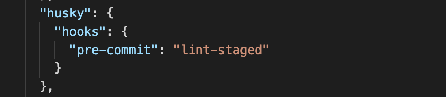
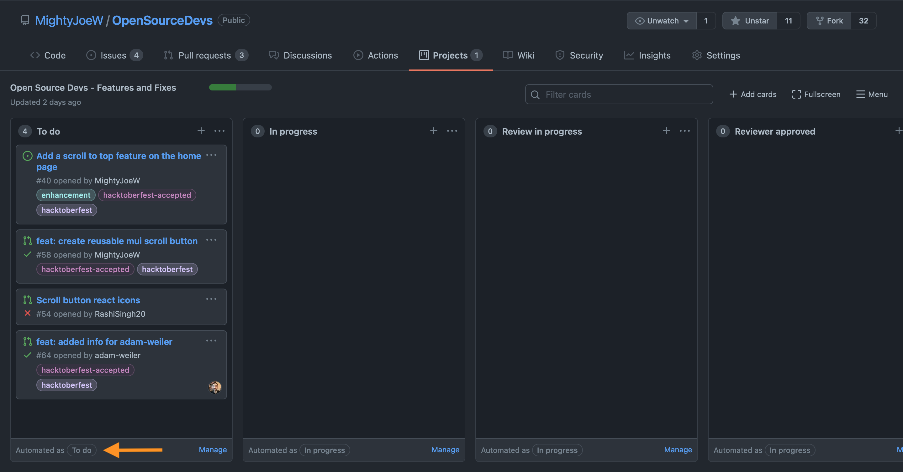
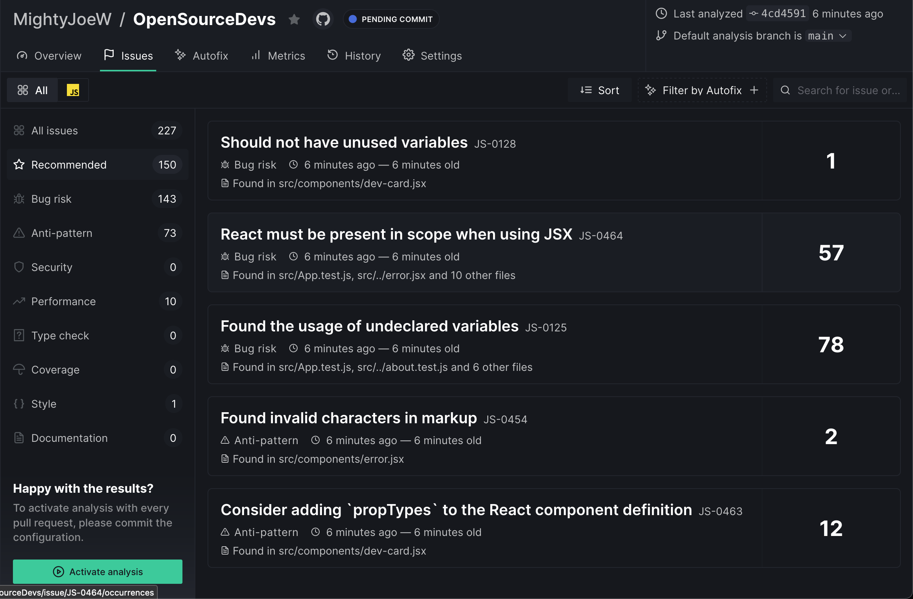
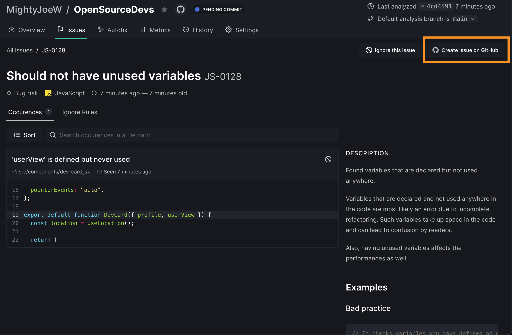
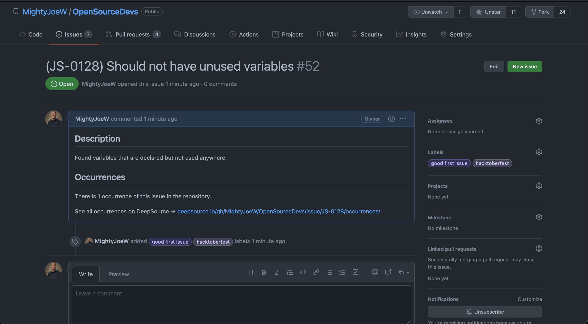

<figure>
  
  <figcaption style="text-align: center">Photographer: <a href="https://unsplash.com/@agk42" target="_blank" rel="noopener noreferrer">Alex Knight</a></figcaption>
</figure>

Maintaining open-source projects is an exciting yet time-consuming process as it comes with a multitude of responsibilities and unexpected occurences. Due to the manual steps required to update codebases, automation will become your best friend throughout the process. Here are 7 useful automation techniques that will save you time when maintaining a project.

<em>Note: I’ll be referencing GitHub for version control processes, but GitLab can perform many of the same tasks as well.</em>

## Format Code Automatically

<strong>The problem:</strong> When a project has multiple contributors, pull requests oftentimes have different formatting styles which creates inconsistent formatting throughout the project. For example, quotes in files can repeatedly switch between single and double depending on who made the last edit. In addition to the inconsistency created, it also makes reviewing the code more challenging as the pull request differences will show every line that has a format change in addition to the changes the contributor manually made.

<strong>The solution:</strong>
As a project maintainer, you can explicitly explain your formatting setup in a contribution guide. This is a good practice, but it’s not guaranteed that contributors will read and code based on the rules in your contribution guide.

To resolve this issue, configure your project to automatically format code before the contributor’s code even makes it to GitHub. Husky is a useful npm package that enables pre-commit hooks. If you are formatting your code with tools such as Prettier or ES Lint, you can enable Husky to run Prettier and lint to check for errors and format code anytime a contributor commits code.

<figure style="text-align: center">
  
</figure>

<em>If you are using create-react-app, you can set up Husky quickly with the steps <a href="https://create-react-app.dev/docs/setting-up-your-editor/#formatting-code-automatically" target="_blank" rel="noopener noreferrer">here</a> .</em>

## Track Progress with Automated Project Boards

<strong>The problem:</strong> As your project grows, it’s crucial to have a manageable process for tracking progress. Features, bugs, and maintenance tasks can slip through the cracks when not being tracked.

<strong>The solution:</strong>
When it comes to managing projects, there is no shortage of project management tools. Chances are you’ve used software like Jira at your job or Trello for personal projects. Github actually has its own project manager which can be utilized in any repository.

Including a Kanban-style board available directly in your repository prevents contributors from needing to navigate to an external source for status updates. Plus, Github project boards provide templates with automation features. For example, new issues can be automatically added to a Todo column and new pull requests can be automatically added to an In Progress column. Items move to review columns and eventually to the done column as actions are taken on the pull request.

<figure>
  
  <figcaption style="text-align: center"><a href="https://github.com/MightyJoeW/OpenSourceDevs/projects/1" target="_blank" rel="noopener noreferrer">Open Source Devs GitHub project board
</a></figcaption>
</figure>

Utilizing automated project boards will keep your projects organized while making the status of each feature and bug visible to everyone at all times.

## Implement Automated Code Analysis

<strong>The problem:</strong>
Maintaining a codebase becomes more time-consuming as the project grows, and it can be difficult for you to manually scan and identify every issue in the code. This can result in an accumulation of code that uses poor habits.

<strong>The solution:</strong>
Save time by adding a static analysis application to analyze pull requests, format code, and even generate fixes for issues. I gave <a href="https://deepsource.io/" target="_blank" rel="noopener noreferrer">Deepsource</a> a try after Digital Ocean announced their collaboration with them for Hacktoberfest, and I’d highly recommend having Deepsource (or a platform of your choice) analyze one of your repositories.

<figure>
  
  <figcaption style="text-align: center">Issues discovered by Deepsource</figcaption>
</figure>

Beyond the analysis, Deepsource’s integration with GitHub alllows you to convert Deepsource issues to GitHub issues with the click of a button.

<figure>
  
  <figcaption style="text-align: center">Create issue on GitHub</figcaption>
</figure>

<figure>
  
  <figcaption style="text-align: center">GitHub issue via Deepsource</figcaption>
</figure>

<em>There is also a useful auto-fix feature, but I wouldn’t recommend it for a hacktoberfest project as it would take opportunities away from contributors.</em>

## Create Pull Request Templates

<strong>The problem:</strong>
Pull Requests are created when a contributor wants some code they’ve written to be added, and the process is much longer when the pull request has no information about what the change is, why it’s needed, or what it looks like. Pull Requests do not have templates by default, so it’s very easy for contributors to create one without providing any details about their changes.

<strong>The solution:</strong>
GitHub provides a simple way to create Pull Request templates for your project. But implementing a pull request template, each pull request will be automatically populated with whatever content you include in the template.

For example, you can write a section in your template for a description of changes, include a table for contributors to drag in before and after screenshots, and create a checklist of things you want contributors to confirm they did i.e checking the desktop and mobile views.

```
## Proposed changes
Describe the big picture of your changes here to communicate to the
maintainers why we should accept this pull request. If it fixes a bug or
resolves a feature request, be sure to link to that issue.

## Types of changes
What types of changes does your code introduce? Put an x in the boxes that
apply.

- [ ] Bugfix (non-breaking change which fixes an issue)
- [ ] New feature (non-breaking change which adds functionality)
- [ ] Breaking change (fix or feature that would cause existing functionality
to not work as expected)
- [ ] Documentation Update (if none of the other choices apply)

## Screenshots of change
Before|After
----|----
(replace with before screenshot)|(replace with after screenshot)

## Checklist
Put an x in the boxes that apply. You can also fill these out after creating the
PR. Ask questions if you're unsure about any of the checkboxes.

- [ ] I have tested desktop and mobile views
- [ ] Lint (`yarn lint`) and unit tests (`yarn test`) pass locally with my changes
- [ ] I have added tests that prove my fix is effective or that my feature works
- [ ] I have added necessary documentation (if appropriate)

```

While contributors won’t be required to actually add their corresponding details to the auto-populated template, having one in place increases the odds of receiving useful pull request descriptions by demonstrating what kind of info is useful and prevents contributors from having to fill out the pull request from scratch.

For more info information on creating pull request templates, follow the steps in GitHub’s guide <a href="https://docs.github.com/en/communities/using-templates-to-encourage-useful-issues-and-pull-requests/creating-a-pull-request-template-for-your-repository" target="_blank" rel="noopener noreferrer">here</a>.

## Create Issue Templates

<strong>The problem:</strong> Users are able to create an Issue in your project if they have identified some problem that needs a solution. Similar to pull requests, issues can be submitted without enough useful information of what the problem is or how to recreate it.

<strong>The solution:</strong>
GitHub also allows the creation and utilization of Issue templates. After determining what info you deem useful for a discovered issue, head to GitHub’s <a href="https://docs.github.com/en/communities/using-templates-to-encourage-useful-issues-and-pull-requests/configuring-issue-templates-for-your-repository" target="_blank" rel="noopener noreferrer">guide</a> to create a template.

Not sure what to include? Check out the templates I’m using for feature requests and bug reqports Open Source Devs <a href="https://github.com/MightyJoeW/OpenSourceDevs/tree/main/.github/ISSUE_TEMPLATE" target="_blank" rel="noopener noreferrer">here</a>.

## Setup Deploy Previews for Branches

<strong>The problem:</strong>
When a pull request is submitted, it’s not initially clear what the change looks like or how it behaves. The reviewer needs to do a combination of reviewing the code and pulling down the code locally to see it running in a browser action.

<strong>The solution:</strong>
Implementing deploy previews creates a to view the code running in the browser.

As with most things in tech, there are many options available for deploying your code. I use Netlify on my personal projects which allows you to create deploy previews for each branch. Utilizing this feature and the GitHub/Netlify integration automatically adds a deploy preview link in the pull request when the branch is finished. This allows me to quickly see UI changes (including from my phone when I’m on the go)!

<figure>
  
  <figcaption style="text-align: center">Netlify deploy preview</figcaption>
</figure>

## Create a Code Review Checklist

<strong>The problem:</strong> Steps that aren’t automated can get skipped unintentionally. The goal is to automate wherever possible, but there may be specific things that you want to create a checklist for to be safe.

<strong>The solution:</strong>
Your checklist can be included in your pull request template. Specifically with something like hacktoberfest, include a checkbox to add the hacktoberfest-accpeted label to ensure contributors don’t lose out on gaining an accepted pull request.

If you have some steps in the process that aren’t specifically related to the pull requests, you may opt to keep your checklist in a different location. Overall, though, your code review steps will fit nicely in your pull request template.

---

“Work smarter, not harder” can apply to just about any area of life, and project maintenance is no exception. Implementing solid automation processes increases the likelihood of your project experiencing long-term health and manageable growth.

Plus, if you decide to hand over the keys to someone else in the future, you’ve created an environment that they can step into with much less friction.

<em>Do you have any questions or additional automation techniques that you you find helpful? Leave a comment below or <a href="https://www.linkedin.com/in/josephmwarren/" target="_blank" rel="noopener noreferrer">connect with me on LinkedIn</a>!</em>
