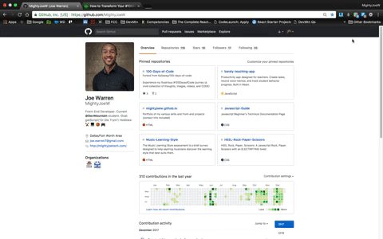

<figure>
  
  <figcaption style="text-align: center">Photographer: William Iven</figcaption>
</figure>

Time is money, and a wise person once told me to work smarter not harder. There are countless apps and extensions designed to improve your efficiency, and I will be focusing on 7 of my favorites when coding.

###1. Speed Listening
Speed listening is something that I still can’t believe I wasn’t previously utilizing. As a podcast enthusiast and as someone who often learns via videos, having the ability to adjust playback speeds has dramatically increased the amount of content that I’m able to consume each day.

<figure>
  
</figure>

This is especially useful when watching longer programming videos. Not all video platforms have speed controls available for users. For video platforms without speed controls, I use the <a href="https://chrome.google.com/webstore/detail/video-speed-controller/nffaoalbilbmmfgbnbgppjihopabppdk?hl=en" target="_blank" ref="noopener">Video Speed Controller</a> Chrome extension.

###2. Clipy
The <a href="https://clipy-app.com/" target="_blank" rel="noopener">Clipy</a> clipboard extension has felt like a life saver! Clipy keeps a history of things you’ve copied to your clipboard. This saves me time from having to recopy things over and over.

<figure>
  
</figure>

For example, if I’m going to be using multiple hex color codes, I can copy them all at once and select from my list. My settings are currently configured to keep the last 30 items. Unfortunately for non-Mac users, Clipy is only available on Mac (as of this writing).

###3. Stylish
The <a href="https://chrome.google.com/webstore/detail/stylish-custom-themes-for/fjnbnpbmkenffdnngjfgmeleoegfcffe?hl=en" target="_blank" rel="noopener">Stylish</a> Chrome extension provides custom themes for websites. I love night themes, and Stylish provides a night theme for most sites. In the gif below, you can see what GitHub and Medium look like with Stylish night themes.

  <figure>
    
  </figure>

  ###4. Pesticide
  The <a href="https://chrome.google.com/webstore/detail/pesticide-for-chrome/bblbgcheenepgnnajgfpiicnbbdmmooh?hl=en-US" target="_blank" rel="noopener">Pesticide</a> Chrome extension provides outlining of elements to better see placement on the page. This app is incredibly helpful when arranging items in CSS.

  <figure>
    
  </figure>

Pesticide can help clear up confusion when working with positioning. When your divs are not behaving properly, check with Pesticide to see if things are set up the way you think they are. You can also use Pesticide on other websites to see how everything is nested and positioned.

###5. Wappalyzer and BuiltWith
<a href="https://chrome.google.com/webstore/detail/wappalyzer/gppongmhjkpfnbhagpmjfkannfbllamg?hl=en" target="_blank" rel="noopener">Wappalyzer</a> and <a href="https://chrome.google.com/webstore/detail/builtwith-technology-prof/dapjbgnjinbpoindlpdmhochffioedbn?hl=en" target="_blank" rel="noopener">BuiltWith</a> are both Chrome extensions that provide details about the technology that was used to build a website. These handy tools provide instant insight and information about the development of any page you visit.

<figure>
  
</figure>

###6. Trello
I didn’t initially like Trello, but it has become my go-to productivity app. It took me awhile to get used to it, but after giving it some time, I immediately grew attached.

<figure>
  
  <figcaption style="text-align: center">Example of a Trello task list</figcaption>
</figure>

Trello provides all kinds of productivity and customization features to help you stay organized with things such as tasks, goals, and to-do lists. It also has great collaboration capabilities. Trello’s mobile app is just as smooth, so I’m often adding tasks and ideas while on the go.

###7. White Noise Generator 
Working in a noisy environment, I rely heavily on a white noise generator. There are many options out there, but <a href="https://mynoise.net/NoiseMachines/whiteNoiseGenerator.php" target="_blank" rel="noopener">this</a> is the site that I’ve relied on to block out surrounding noise.

<figure>
  
  <figcaption style="text-align: center">White Noise Generator Homepage</figcaption>
</figure>

Although I can work in the midst of noise, I prefer to work in a quiet environment. White noise doesn’t create silence, but it at least drowns out surrounding noise. White noise also has many health benefits.

###BONUS: MeetUp
<figure>
  
</figure>

<a href="https://www.meetup.com/" target="_blank" rel="noopener">MeetUp.com</a> is what really kicked off my journey into coding, so I am very adamant about introducing others to it. The morning that I decided to pursue coding, I simply Googled ‘tech events near me.’ Meetup.com appeared with a list of multiple tech events near me for each day of the week. By attending Meetups, I’ve met people, gained friends, learned new things <strong>for free</strong>, and have also received emails with exclusive info such as how to sign up for Google’s Sandbox event.

<figure>
  
  <figcaption style="text-align: center">Example of list of tech events on Meetup</figcaption>
</figure>

<a href="https://www.eventbrite.com/" target="_blank" rel="noopener">Eventbrite</a> is another good site for finding events. No matter what you are interested in, these sites/apps will likely have an event for it. Many events provide free food as well. So get out there and connect with people while eating food and learning new tech for free (most of the times)!

<em>What are your favorite productivity hacks? Do you have any thoughts, comments or questions? Leave a comment below or <a href="https://www.linkedin.com/in/josephmwarren/" target="_blank" rel="noopener">connect with me on LinkedIn</a>.</em>