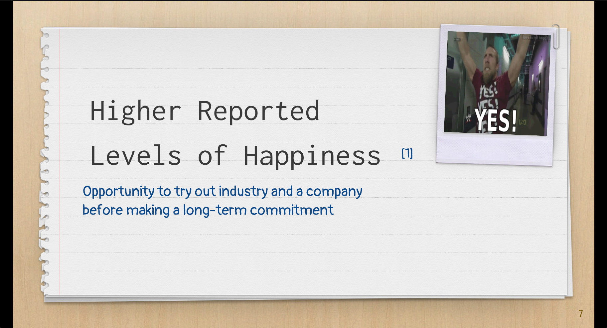
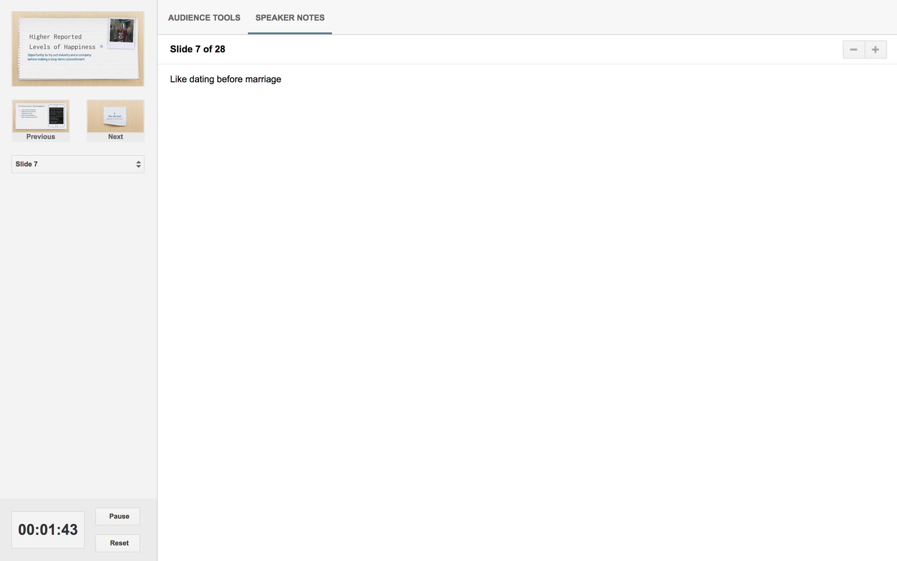

<figure>
  
  <figcaption style="text-align: center">Photographer: Fred Mouniguet</figcaption>
</figure>

The mere thought of public speaking sends many of us into a state of panic. Even those of us who are not shy battle with fears and concerns such as:

“What if I mess up?”

“I’m not a good speaker.”

“I didn’t have enough time to prepare.”

“What if someone asks a question that I can’t answer?”

“What if this audience doesn’t find value in my content?”

“What if there is something in my teeth…or nose?!”

Whether you are a student, a job-seeker, or already on a job, there is a good chance that you will eventually be in a position to present something you’ve created, something you’d like to implement, or a topic you have knowledge on.

I am not a professional public speaker, so my focus in this article is not on how to become a better speaker. My goal is to help you, the presenter, actually enjoy the process of speaking in front of others opposed to dreading it.

Based on the positive feedback I’ve received from my recent tech talks, I’ll share 5 things that I remind myself that lead to a more enjoyable experience.

###I’m not going to die.
This may sound extreme, but if it takes going to the extreme to help you change your perspective then it’s worth it. Keep in mind that no matter how the presentation or performance goes, you’re not going to die. Now, if you have some serious health concerns or an enemy floating around somewhere, maybe consider addressing that before getting on a stage…

Otherwise, you are not going to die as a direct result of giving a speech!
Whether your performance was great or horrific, life will go on, people will soon be focusing on the next thing that grabs their attention, and you’ll have plenty of more opportunities in the future to try new things.

This is my last resort perspective but an effective one for the more stressful times.

###This is an opportunity to have a conversation with friends and family about something I’m passionate about.
This is my biggest motivator when getting ready to speak in front of people. I’ve found that for me personally, it turns my nerves into excitement when I think of the crowd as a bunch of friends that I’m talking to. It helps me relax as it decreases my internal pressure and enables me to be myself on stage.

###If I’m having fun, they’ll have fun.
This is an extension of the point above. Crowds generally welcome someone that is light-hearted and funny. When I’m preparing to give a talk, I’m always thinking about whether or not I’d be interested in the talk if I was in the crowd. I don’t enjoy being bored, so I don’t want others to be bored either.

I am a huge fan of story-telling because it has the power to grab people’s attention in ways that your informative content cannot do alone. In addition to story-telling, humor and crowd interaction helps to keep people interested and engaged. If you’re simply a non-funny human, you can still try out a joke or two. If no one laughs, say some things that will at least make you laugh.

<iframe width="560" height="315" src="https://www.youtube.com/embed/HuumGRGpYDo" frameborder="0" allow="accelerometer; autoplay; encrypted-media; gyroscope; picture-in-picture" allowfullscreen></iframe>

While your priority is delivering good content to those that made a conscious decision to sit and listen to you, I believe it’s just as important that you get to enjoy the process since you’ve put in the work and experienced the stress of preparing & putting yourself out there.

###Be myself.
Presentations are important, especially if a job or position depends on your performance. But for me personally, I’ve found that my presentations are much better when I’m having fun while presenting information. When trying to perfectly articulate every word or use a strictly “professional” tone, I feel robotic and come across as inauthentic.

<iframe width="560" height="315" src="https://www.youtube.com/embed/QCAHF0Ssg7c" frameborder="0" allow="accelerometer; autoplay; encrypted-media; gyroscope; picture-in-picture" allowfullscreen></iframe>

The preparation and practice was done beforehand so I’m going to deliver the information and value that I promised, but it doesn’t have to be in someone else’s voice or style to sound how I think a professional should sound.

###Have notes available and in sight
Assuming that you have prepared your talk and visual content, this is a simple reminder to have notes for yourself available. It’s easy to get lost mid-thought or forget to mention a key point. In my latest talk Web Development Internships: A View from the Inside, I used Google Slides and showed my slides on a second screen in presenter view so I could see my speaker notes along with a timer at any moment on my laptop.

<figure>
  
  <figcaption style="text-align: center">Audience View from Presenter View</figcaption>
</figure>

<figure>
  
  <figcaption style="text-align: center">My View from Presenter View</figcaption>
</figure>

Everyone has a powerful story to tell or valuable information to share, and it is my desire to help others with this process. Even if we’re not “professional” speakers, we are indeed capable of speaking to give back to the community while figuring out ways to have fun throughout the process. Specifically in the world of development, no matter how little you know, you have information, experience, and value that others will benefit and learn from.

<em>Have you given any public talks or presentations? Do you have any techniques that help you overcome fears related to public speaking? Leave a comment below or <a href="https://www.linkedin.com/in/josephmwarren/" target="_blank" rel="noopener noreferrer">connect with me on LinkedIn</a>.</em>