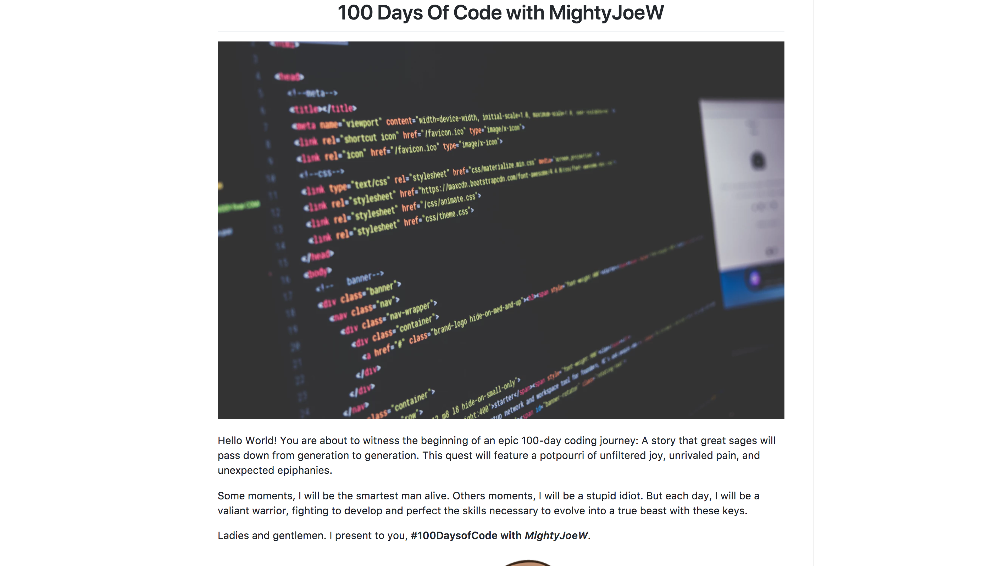

<figure>
  
  <figcaption style="text-align: center">Photographer: Lauren Mancke</figcaption>
</figure>

Learning how to code is an unrivaled modern experience. As an aspiring developer, no matter what level you’re at, you have a unique and fascinating story to tell based on your personal experiences and creations.

However, lacking the ability to effectively tell your story or generate interest can lead to many missed opportunities. Alexander Kallaway’s #100DaysOfCode challenge encourages you to code for at least an hour every day for 100 days. The challenge provides a helpful sample log for documenting and sharing your daily progress.

While I truly appreciate the sample log, the story-teller in me wouldn’t allow my log to look identical to everyone else’s. Plus, I couldn’t imagine anyone reading through my 100 text-based entries (besides possibly my mom).

<figure>
  
  <figcaption style="text-align: center">Screenshot of #100DaysOfCode Log Template</figcaption>
</figure>

As a creator, I wanted to accompany my posts with descriptive images.

I didn’t want to simply tell what I worked on. I wanted to show exactly what my projects looked like at different stages.

I strongly believe in making it as easy as possible for potential employers and recruiters to see your work. People are busy and may not make it very far down your list of 100 text-exclusive entries. And even if you aren’t yet trying to attract potential employers, you will still have a more entertaining and enjoyable experience for friends and other developers to check out.

###Tips and Suggestions
<strong>Create an Introduction</strong> - This can be a short and sweet introduction of who you are and what your log is. This will give your log life right from the beginning as your viewer can connect with you as a human. I also included an image at the top of mine to make it feel more like an article or story.

<figure>
  
  <figcaption style="text-align: center">Example of a #100DaysOfCode Log introduction</figcaption>
</figure>

Add photos, screenshots, and gifs - The #100DaysofCode logs are very long and wordy. Images for each entry will greatly help with quickly showing what you’ve worked on.

<figure>
  
  <figcaption style="text-align: center">#100DaysOfCode post with images</figcaption>
</figure>

Add screenshots of things such as your actual code, a work in progress, a finished site, and even memes to drive home points. To hyperlink screenshots, I uploaded my screenshots to Google Photos and copied the links from there. Use any method that works best for you.

<figure>
  
  <figcaption style="text-align: center">#100DaysOfCode post featuring an Arduino setup</figcaption>
</figure>

<strong>Include links to live projects</strong> - It’s great having links to your GitHub repos, but again, let’s help out your viewers. Everyone will not take the time to look through your code or clone your repos to see your projects. GitHub Pages provides free hosting for your sites online. If you use Codepen, include those links too.

<strong>Pin on Twitter</strong> - If you are doing the daily #100DaysOfCode tweets, consider creating and pinning a tweet about your log with a link to it. That way, anyone who sees your Twitter page will immediately have a link to your vivid coding journey. To pin a tweet, click the downward pointing arrow at the top right corner of your tweet and select ‘Pin to your profile page.’

<strong>Below is the code format I created for my posts. Feel free to copy and use for your posts.</strong>

```
<h2 align=”center”>
Day 1: Day Month 01, 2018
</h2>

**Today’s Progress**: Write progress here.
**Thoughts:** Write additional thoughts here.
**Link to tweet:** [yourName Day 1](insertLinkToTweet)
**Link to work:** [nameOfWork](insertLinkHere)
```

If using the format above on your log in GitHub, you can replace the # in  with a link to any photo. Right click on the photo that you want to use and select ‘Copy Image Address’ to be able use your photo.

<strong>If you would like to use a gif</strong>, giphy.com has a quick and easy process for converting videos to gifs. When finished, you’ll click on the link icon on your newly created gif to copy the link. Then in your img tag in your log, replace the hashtag with your gif link like the code snippet below.

```

```

At the end of the day, #100DaysOfCode is all about having fun learning how to code on a consistent basis, so no need to worry if you don’t have time to do more detailed logs. It does take some extra time, but it’s worth having a unique log that captures and displays your progress over a 100-day period.

If you have any thoughts, comments or questions, feel free to comment below or connect with me on [LinkedIn](https://www.linkedin.com/in/josephmwarren/). Lastly, you can check out my #100DaysOfCode round one log [here](https://github.com/MightyJoeW/100-Days-of-Code/blob/master/log.md).

Good luck and have fun!