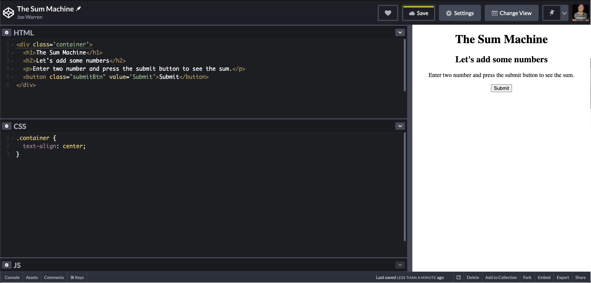

<figure>
  
  <figcaption style="text-align: center">Photographer: Jeshoots</figcaption>
</figure>

So you’re interested in coding, but you are unsure if your math skills are up to par. Programming must require a deep understanding of advanced mathematical concepts, right?

What if I told you that you could have a long, successful career in web development while barely using any math (if any at all)? 

To understand this, let’s first look at the three primary languages that make up a website: HTML, CSS, and JavaScript.


###Creating structure with HTML
<figure>
  
  <figcaption style="text-align: center">Photographer: Avel Chuklanov</figcaption>
</figure>

HTML stands for hypertext markup language, and this serves as the structure of a website. Think of this as the foundation or framing of your house.

HTML is all text-based (no math required here). The syntax requires you to place a start tag and end tag around your text to tell browsers what kind of text it is and how to display it.

For example, let’s say we want to create a webpage that features a basic calculator. <em>I will be using the free online code editor <a href="https://codepen.io/" target="_blank" rel="noopener noreferrer">Codepen</a>. If you don’t already have a Codepen account, I would suggest creating one so you can quickly get started writing code, save your work online, and have the option of sharing your work with others.</em>

We want a large header text at the top of the page to say, "The Sum Machine".

To do this, you will use an `h1` tag in this manner:

```<h1>The Sum Machine</h1>```

<figure>
  
</figure>

We also want to show a subheader that says, "Let’s add some numbers". We can create a subheader with an `h2` tag.

```<h2>Let’s add some numbers</h2>```

<figure>
  
</figure>


HTML provides an assortment of handy tags that allow you to build a complete webpage. We can use HTML to create headers, paragraphs, lists, forms, and so much more.

Let’s use a `p` tag to create a paragraph that explains what to do.

```<p>Enter two numbers and press the submit button to see the sum.</p>```

<figure>
  
</figure>

Lastly, let’s use a `button` tag to create a button.

```<button>Submit</button>```

<figure>
  
</figure>

Hooray! We have just created a webpage. It’s not pretty, and it can’t do anything yet, but the structure is in place. Even though we created a page featuring a calculator, you can see that HTML doesn’t require math to create elements.

And don’t worry about memorizing all of the various HTML  tags. As you continue to build, you’ll remember many of them over time. Anytime you can’t remember, simply do a Google search to find the tag that you need.

###Adding Styling with CSS
<figure>
  
  <figcaption style="text-align: center">Photographer: Kara Eads</figcaption>
</figure>

CSS stands for cascading style sheets and is responsible for making your site visually appealing. With CSS, you can add colors, change fonts, reposition elements, and so on. If HTML is the framing of your house, CSS is the paint and decorations. 

Think about the text editing tools in an environment like Word Document or Google Docs. CSS uses actual code instead of clicking on icons to make changes to elements.

Let’s say we want to center our calculator horizontally. What we’ll want to do first is wrap all of our tags in a parent element, such as a `div` ( a `div` defines a division or a section and is often used to contain other elements). Wrapping the content in a parent element will group them all together, allowing us to apply one style to all of them at one time. 

```
<div>
    <h1>The Sum Machine</h1>
    <h2>Let's add some numbers</h2>
    <p>Enter two number and press the submit button to see the sum.</p>
    <button>Submit</button>
</div>
```

<em>There are more specific elements that you can use to make your page more accessible/descriptive (semantic HTML), but we'll stick with `div` for now.</em>

To apply a style to an element, CSS needs to know which element to target. You do this by providing an element with an `id` or a `class`.

An `id` is a unique identifier attribute that will only be used for one element throughout your site. A `class` attribute can be applied to multiple elements.

Since I may want to center other groups of content later on, I’m going to add a `class` attribute and set it equal to container. Like variables, I could have named this anything, but I chose container to indicate that this `div` exists to contain other elements. 

```
<div class=“container”>
    <h1>The Sum Machine</h1>
    <h2>Let's add some numbers</h2>
    <p>Enter two number and press the submit button to see the sum.</p>
    <button>Submit</button>
</div>
```

Now, CSS can look for the container `class` using a period followed by the class name and curly braces. 

```
.container {

}
```

Inside the curly braces, you’ll create key-value pairs explaining what you want to do. 

```
.container {
    text-align: center;
}
```


<figure>
  
</figure>

This is the equivalent of clicking the center align button in a word processor. It moves the element to the center of the page horizontally. 

<figure>
  
</figure>

We also want to make the submit button green with white text. Let’s give the button a `class` of submitBtn.

```<button class=“submitBtn”>Submit</submit>```

Now, let’s find the submitBtn `class` in CSS.

```
.submitBtn {
    background: green;
    color: white;
}
```

<figure>
  
</figure>

CSS can do much more than changing colors and positioning. CSS can do animations, transitions, and even calculations. 

You can dive deeply into CSS and find useful cases where math is required. However, much of your CSS will be free of any math calculations. 

The most common math in CSS is determining the size of an element using pixels (i.e. `height: 50px`) or percentages (i.e. `width: 50%`).

###Bringing it to Life with JavaScript
<figure>
  
  <figcaption style="text-align: center">Photographer: Maria Lin Kim</figcaption>
</figure>

JavaScript is the programming language that provides functionality to your website (i.e. clicking a button to go to the next page). Continuing our house analogy, JavaScript makes the garage open when you press a button or runs water when you turn on the faucet.

One of the most frequently used concepts in programming is the use of variables to store values. The usage of variables is where basic algebra comes into play (remember solving for `x` in school)?

In a basic algebra problem that solves for `x`, `x` has a value that you are trying to find. For example, consider the following: `x + 8 = 10`. To find the value of `x`, you need to subtract `8` from `10` to get the value of `2`. The value of `x is 2`. 

This problem is more complicated than much of the math you’ll use for basic web development. With algebra problems, you have to solve the equation yourself. With JavaScript, you can create functions to solve problems for you. More on that later.

Imagine we know that our user's name is something iconic like Joe. We want to store that name in a variable to make our code easier to maintain. 

`const userName = ‘Joe’;`

`const` represents a constant variable.

`userName` is the name I decided to give the variable. You can name your variables just about 
anything, but it’s always best to choose a name that makes the most sense for your application. 

`‘Joe’` is the value that I assigned to the `userName` variable. 

By creating a variable with the user’s name, I can now reference `userName` anywhere in my site and it will display the text `  Joe`. If I want to change the name to something else, I only have to change the value of userName opposed to changing every individual instance of `Joe` throughout the site.

Now that we've explored the importance of storing values in variables, let’s look back at our calculator. After the user enters two numbers and presses the Submit button, we want JavaScript to add the two numbers together. We will do so using a function.

The beautiful part about programming languages is that they will do the calculations for you. You just need to learn how to set up the function to do so. 

```
const sum = function(a, b) {
    return a + b;
}
```

Let’s break down what we are doing here. 

First, we created a function named `sum`. `sum` is a function that takes in two parameters (`a` and `b`), and always returns `a` + `b`.

`a` and `b` are place holders. When I want to actually add two numbers using this function, I’ll call the function using two real numbers like so:

`sum(2,3)` will return 2 + 3 which equals 5

If you know what problem you are trying to solve, you can write different functions to handle any math or calculations needed in your site or app. I can now get the result of `82304` + `62993` instantly because of this little function. I have no idea what that answer is off the top of my head, but `sum(82304, 62993)` will calculate the answer immediately 😉

###Putting it all together
<figure>
  
  <figcaption style="text-align: center">Photographer: Nick Romanov</figcaption>
</figure>

Our Sum Machine is nearly finished. We just would need to add a couple of things to HTML and JavaScript for the submit button to display the answer. 

In HTML, we will use a `Form` element with two input fields for the user to enter the numbers to add. In JavaScript, we’ll find those two numbers and create variables that can be inserted into our `sum()` function. 

Breaking down form submission and document methods is beyond the scope of this article, but you can view the code and use The Sum Machine <a href="https://codepen.io/MightyJoeW/pen/JjXXxLY" target="_blank" rel="noopener noreferrer">here on Codepen</a>.

<figure>
  
</figure>

###In Conclusion
Do you need to know math to use HTML? <strong>No</strong> <br />
Do you need to know math to use CSS? <strong>No</strong> <br />
Do you need to know math to use JavaScript? <strong>At least basic algebra</strong>

HTML and CSS alone are vast languages that are capable of creating beautiful web experiences, complete with modern styles and stunning visuals without any math.

Although JavaScript does require a basic understanding of algebra, you absolutely do not need to be a math guru to create awesome sites and apps. 

As you continue to learn and build with JavaScript, these concepts will become second nature as you figure out how to create functions that will do the heavy lifting for you.

Just keep in mind that apps with greater complexity may require a deeper understanding of math depending on what you’re trying to do (i.e. programming your own animations).

Lastly, if you have no desire to learn how to code but need to put a site together, you can use a drag-and-drop CMS such as Wordpress.

<em>Leave a comment below if you have any thoughts, comments, or questions. Also, feel free to <a href="https://www.linkedin.com/in/josephmwarren/" target="_blank" rel="noopener noreferrer">connect with me on LinkedIn</a>.</em>