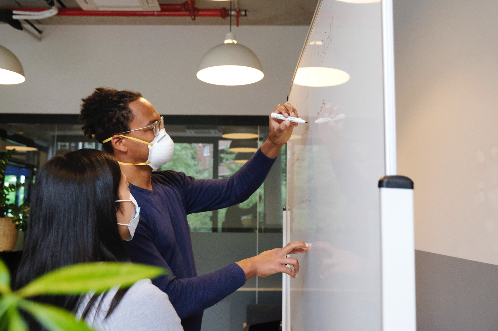

<figure>
  
  <figcaption style="text-align: center">Photographer: <a href="http://instagram.com/drew_hays" target="_blank" rel="noopener">Drew Hays</a></figcaption>
</figure>

<em>Technical interviews</em>. This phrase can send chills down the spine of even the bravest engineers. The nature of a technical interview can vary wildly from company to company, and this unpredictability adds an unnecessary layer of stress to the process. 

Technical interviews are a tricky endeavor, and the pandemic has added yet another component of unpredictability to the process. Fortunately, though, there are many ways you can position yourself to succeed in your interviews.

I experienced a challenging job hunt which included 132 applications submitted, 20 interviews, and eventually 4 offers total. I also have first hand experience brainstorming interview approaches with teammates, assessing candidates, and chatting with colleagues from other companies about their interview processes.

This article is an accumulation of real world experience which can serve as your guide to interview preparation and execution.

###Before the battle: Know Your Story.
<figure>
  
  <figcaption style="text-align: center">Photographer: <a href="armedshutter.com" target="_blank" rel="noopener">Ayo Ogunseinde</a></figcaption>
</figure>

Before you even think about flawlessly maneuvering through technical interviews, it is highly recommended to spend time polishing your story. First impressions are critical, and I’m sure you’ve heard about having a 30 second elevator pitch prepared.

This is so important as there is a great chance that your interviewer will kick off the interview with the statement <em>Tell me a little bit about yourself</em>. This opportunity to tell your story should not be taken lightly as it can set the tone for the rest of your time with the interviewer. 

Your answer shouldn’t be some long-winded, unfocused stream of thoughts. You also don’t want to come across as unsure why you’re even interviewing for this position. Find a way to use your unique background and experiences to highlight your skills and passion related to this job and career. 

This doesn’t only apply to interviews. If you’re at a Meetup or a networking event and you seriously want a job, practice articulating exactly what you are looking for while highlighting your skills and personality. Also, don’t leave it up to others to come find you. Seek out the people who are hiring or who know of people that are hiring, have a conversation about what you do and what you're looking for, and exchange contact information.

###The Phone Screen
<figure>
  
  <figcaption style="text-align: center">Photographer: <a href="http://jeshoots.com" target="_blank" rel="noopener">jeshoots</a></figcaption>
</figure>

If a company has recruiters, this will likely be the first person you engage with. A call with the recruiter is a feeling-out process in which the recruiter is seeing if you have the basic skills that the company is looking for. 

They are also trying to gauge if you would be a good culture fit, so it’s great if you are able to show some personality and interpersonal skills. You want to leave a positive impression on the recruiter so that they will feel confident putting you through to the next step.

Expect to talk about your background and story, discuss projects you’ve worked on, and answer some high level questions about the technologies you’ve used. You won’t be solving any algorithm problems or building any code, but you should be able to speak confidently about projects you have previously worked on.

Before hanging up, <strong>ask questions</strong>! Learn whatever you can about the company and the nature of the remaining interviews. This will also show that you are interested and engaged.

###The Phone Interview
<figure>
  
  <figcaption style="text-align: center">Photographer: <a href="http://instagram.com/austindistel" target="_blank" rel="noopener">Austin Distel</a></figcaption>
</figure>

Companies start to branch off into different directions at this stage of the interview process, but many of them follow up the phone screen with a phone interview. 

This interview will have a more technical feel as it will be conducted by technical team members such as an IT manager and/or a lead dev. At this stage, they’ll want to know your story (good thing you’ve been working on this) and your technical capabilities. Expect to answer behavioral questions such as the following:
* Tell me about your experience
* How do you keep up with new tech?
* Tell me about a challenge you’ve had and how you overcame it
* What is something you’ve built or solved that you are proud of?
* Tell me about a time a teammate had an issue with you and how you resolved it

Spend time thinking about how you'd answer these kinds of inquiries so you aren't drawing a blank on the spot. You won't know exactly what will be asked, but it's good to have specific examples of problems you solved and conflict you resolved with teammates.

You may also be quizzed on their tech stack. For example, a React team may check if you are able to discuss the following:
* Class vs function components
* State and props
* Accessing child component state in the parent component
* Lifecycle methods
* The <i>this</i> keyword
* Regular functions vs arrow functions
* Function scope vs block scope
* Usage of array methods like map, reduce, filter
* Redux usage

You may also be asked about your experience with practices and tools such as unit testing and Git.

If you have used a particular method before, briefly describe how you've used it before after defining what it is.

Do your best to answer each question, but understand that a question likely will trip you up. There are different beliefs of how you should go about responding to a question in which you do not know the answer. Some believe to fake it until you make it (just confidently make something up). 

I would not recommend doing this as the interviewer will know immediately if you don’t know what you’re talking about. It’ll just waste time. Also keep in mind that they are picturing working with you. There will be things that you don’t know on the job or may have a vague idea about that you need to ask them about. Responding positively to adversity provides insight to how you will respond on the job. 

When finished, <strong>ask questions</strong>! This is your time to fire away to gain as much insight about the company and the team as possible. Although it can be intimidating and feel like a one-way interview, it is a two-way interview. This will be a marriage, and you want to know about your partner as well. During my interviews, my questions led to great conversations and invaluable insight about the team. 

Below are examples of great questions to ask:
* What is your biggest challenge/pain point right now?
* Can you describe the company culture?
* How do devs know what to work on each day?
* Is there a vision for a long-term career path?
* How is performance measured?
* Do you have any feedback for me?

###The Technical Interview.
<figure>
  
  <figcaption style="text-align: center">Photographer: <a href="http://airfocus.com" target="_blank" rel="noopener">airfocus</a></figcaption>
</figure>

Having fun yet? You are now in the waiting game. Companies have many candidates and information to process while yet having daily work assignments and deadlines. Getting a call back can take awhile, so be patient and continue practicing and applying elsewhere during this time.

When called back, your likely next step will be an in-person interview (expect this to be virtual until covid-19 has gotten under control). The in-person interview usually consists of meeting the team, getting a campus tour, and solving various programming questions. This is a good opportunity to get a feel of the environment and team dynamics. 

Be on the lookout for any warning signs that don’t align with your values i.e. seeing a lack of diversity or ping pong tables covered in dust at a company that promotes how much fun they have at work.

When heading into the technical portion of the interview, take a deep breath and remember that <em>the team is rooting for you</em>! The difficulty of questions should correlate with the level you’re applying for (i.e. shuffle an array for juniors, add new functionality to a small app and/or debug issues for mid and senior levels).

With my in-person interview at USAA, I was fortunate to receive an email ahead of time explaining what I would be asked to do in the interview. If you do not receive any information about the interview ahead of time, reach out to the recruiter or whoever you are in contact with to see if you can get a rundown of what you’ll be doing in the interview. 

Any information you can receive ahead of time is crucial as it can prevent you from preparing for the wrong kind of interview. 

Of my 20 interviews, none of them were exactly the same (and neither were any of my friends’), but there is enough overlap overall to give you an idea of what things you can expect. Below are interview formats that myself and others have experienced:

* <strong>Whiteboard</strong> - solving algorithms (i.e. reverse a string, use function chaining) 
* <strong>Codewars-style algorithm challenges on a computer</strong> (i.e. write a function to generate the Fibonacci sequence through n)
* <strong>Building a small web app that meets specific requirements</strong> (i.e make an api call to retrieve and display data then add stying to match the design comp)
* <strong>Build a static page to match a design comp</strong>
* <strong>Assess a basic react component to point out issues, refactor, etc.</strong>

This is usually the final round, but some companies will then send a take home assignment to test your creativity and understanding of the language or framework that they use.

Jot questions throughout the process so that you don’t forget anything when the time comes to <strong>ask questions</strong>. This is your last shot to gain insight as well as leave a lasting impression. And of course, be courteous and express your gratitude and appreciation for their time.

###Preparation Resources for Technical Interviews
* <a href="https://github.com/h5bp/Front-end-Developer-Interview-Questions" target="_blank" rel="noopener">Front-end Job Interview Questions</a>
* <a href="https://github.com/sudheerj/reactjs-interview-questions" target="_blank" rel="noopener">React Interview Questions</a>
* <a href="https://www.codewars.com" target="_blank" rel="noopener">Codewars</a>

###Application Resources
Be sure to subscribe to job alerts so you're notified when new jobs appear that fit what you're looking for. 

* <a href="https://docs.google.com/spreadsheets/d/1GvXaYXM7O8dCRUWqTBqyVDlboZDwy6RnLPpCLnWez0M/edit#gid=1946609602" target="_blank" rel="noopener">My Personal Job Hunt Worksheet</a> - Feel free to use any of the tabs you find helpful to keep track of your progress. To edit, click File then select Make a Copy.
* [LinkedIn Jobs](https://www.linkedin.com/jobs/)
* <a href="https://www.linkedin.com/mynetwork/" target="_blank" rel="noopener">LinkedIn Network</a> - Connect with people at companies you’re applying to and ask questions.
* Company Career pages (usually found in footer at bottom of homepage)
* <a href="https://www.indeed.com/" target="_blank" rel="noopener">Indeed</a>
* <a href="https://www.ziprecruiter.com/" target="_blank" rel="noopener">Zip Recruiter</a>
* <a href="https://www.glassdoor.com/Job/Home/recentActivity.htm" target="_blank" rel="noopener">Glassdoor Jobs</a>
* Reddit - Use with caution as there are a lot of ways to get distracted on Reddit, but there are quality job forums such as the <a href="https://www.reddit.com/r/reactjs/comments/gudtmn/whos_hiring_june_2020/" target="_blank" rel="noopener">React Who's Hiring</a> or the <a href="https://www.reddit.com/r/webdev/comments/gd0ag1/monthly_getting_started_web_dev_career_thread/" target="_blank" rel="noopener">Web Dev Career</a> threads.

Take advantage of these tools to research and apply to jobs, but remember that you will significantly improve your chances if you <em><strong>develop real relationships with people</strong></em> at different companies. 

Building your network will position you to benefit from referrals and having a good word put in for you.

There is no denying that landing a job can be a challenging endeavor, but I hope that this guide will improve your preparation tactics and increase your chances of landing that dream job. You've got this!

<em>If you have any thoughts, comments or questions, feel free to <a href="https://www.linkedin.com/in/josephmwarren/" target="_blank" rel="noopener">connect with me on LinkedIn</a>.</em>