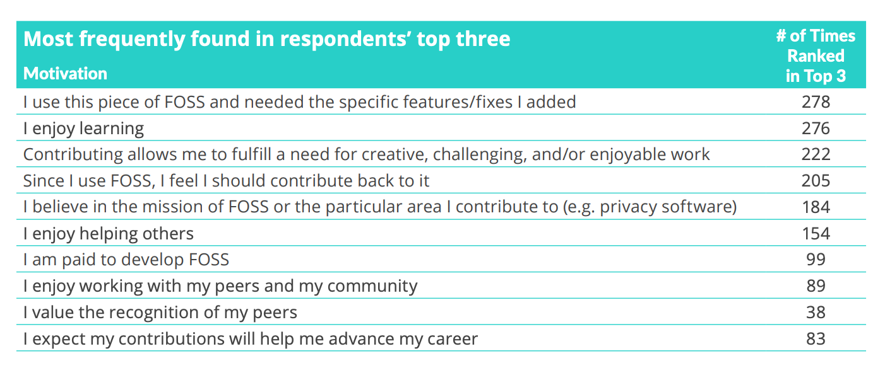
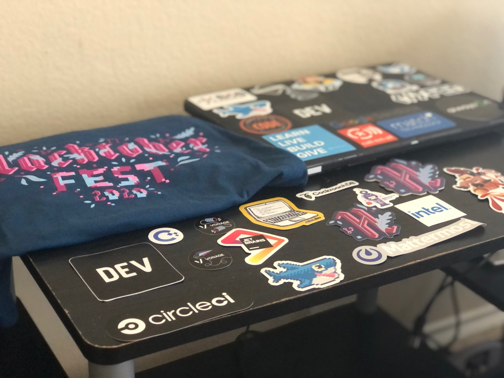
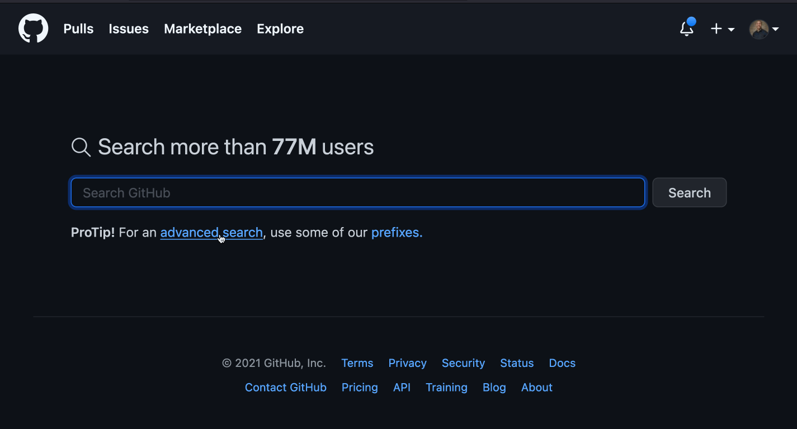
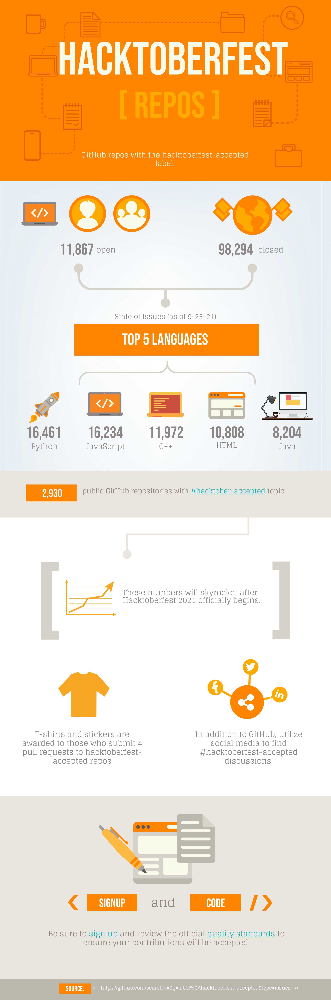

<figure>
  
  <figcaption style="text-align: center">Photographer: <a href="https://unsplash.com/@marvelous" target="_blank" rel="noopener noreferrer">Marvin Meyer
</a></figcaption>
</figure>

One of the most common pieces of advice given to job-seeking developers is to contribute to open-source projects. Contributing to open-source projects provides an array of career growth opportunities including learning how to navigate a new codebase, gaining real-world experience working in a team environment, and building useful features or resolving issues for the community.

Beyond these benefits, open-source projects can lead directly to landing a job. Your contributions generate legitimate resume & portfolio content. A more direct effect would be how Sophie Alpert’s early contributions in the React codebase led to an offer from Facebook’s React core team.

<figure>
  
  <figcaption style="text-align: center">Motivations from 2020 FOSS Contributor Survey
</a></figcaption>
</figure>

That sounds awesome! But where do you start? How does one go about finding an open-source project and actually making a meaningful code change? Let’s explore what open source is and the many ways one can get involved.

##What Is Open Source?
Opensource.com defines open source as “something people can modify and share because its design is publicly accessible” and open source software as “software with source code that anyone can inspect, modify, and enhance.”

As a consumer, open-source projects allow you to download and use products for **free**. If you’re ~~cheap~~ resourceful like me, you probably love free, high-quality software including the following:

- LibreOffice (Microsoft Office alternative)
- Firefox (web browser)
- Audacity (audio software)
- FileZilla (file transferring application)
- BitWarden (password manager)

Contributing to open-source software is like bringing a dish to a potluck to strengthen the overall meal that everyone can enjoy (minus the germs).

<figure style="text-align: center">
  
</figure>

Open-source software comes with licenses that can be viewed in the project where the code lives (oftentimes on GitHub). It’s a good idea to check out each project’s license, but most are constructed in a way that allows the sharing, accessing, and modifying of the code.

<figure>
  
  <figcaption style="text-align: center">GatsbyJS MIT License</figcaption>
</figure>

##Where to Begin

<figure>
  
  <figcaption style="text-align: center">Photographer: <a href="https://unsplash.com/@dallehj" target="_blank" rel="noopener noreferrer">Daniel Jensen
</a></figcaption>
</figure>

Two common roadblocks with contributing to open source relate to not feeling skilled enough to make a meaningful contribution or not knowing how to actually get involved.

You may be surprised at how qualified you are to make contributions right now. For example, my early contributions were fixing typos in codebases. I felt like my little pull requests were insignificant, but two major things transpired.

1.  I created my first experience forking a project outside of my web development boot camp, submitting a pull request, and having my code reviewed and merged into a project.
2.  I was able to help out on a project I cared about. Although my fixes were not resolving a technical bug or building a new feature, the grammatical sanitization enhanced the professionalism of the sites.

<figure>
  
  <!-- <figcaption style="text-align: center">Hacktoberfest</figcaption> -->
</figure>

Digital Ocean’s <a href="https://hacktoberfest.digitalocean.com/" target="_blank" rel="noopener noreferrer">Hacktoberfest
</a> is a great resource for getting started. Every October, Hacktoberfest celebrates and encourages participation in open source projects. The initiative welcomes devs of all skill levels and provides suggestions of projects to contribute to. After submitting 4 pull requests to projects with the `hacktoberfest-accepted` label, you’re eligible to receive some nice swag including laptop stickers and a T-shirt!

<figure>
  
  <figcaption style="text-align: center">My 2020 Hacktoberfest Swag Pack</a></figcaption>
</figure>

If you look through their <a href="https://hacktoberfest.digitalocean.com/resources/beginners" target="_blank" rel="noopener noreferrer">suggestions
</a> and still are unsure where to begin, you can do an advanced GitHub search for projects with the `hacktoberfest-accepted` label.

<figure>
  
</figure>

If you’re not having luck finding a project you feel you can contribute to, you can add the `hacktoberfest-accepted` label on one of your own GitHub projects. Creating quality pull requests for your own project with this label can count toward the 4 needed to complete the challenge.

For the 2020 Hacktoberfest, my wife and I created a `hacktoberfest-accepted` project which displays 10 articles each day to highlight entrepreneurship and tech in the black community. The open issues are accessible <a href="https://github.com/teamwarren/blacktechdaily/issues" target="_blank" rel="noopener noreferrer">here
</a>, and we welcome contributions big and small! The project is currently in a state of basic functionality and styling, so there is plenty of room for contributions.

For more technical details on how to contribute to an open-source project, check out freeCodeCamp’s <a href="https://github.com/freeCodeCamp/how-to-contribute-to-open-source" target="_blank" rel="noopener noreferrer">open-source repo
</a> . GitHub also has a robust guide for <a href="https://opensource.guide/how-to-contribute/" target="_blank" rel="noopener noreferrer">getting started
</a>.

<figure>
  
</figure>

<em>Confused on where to begin or interested in sharing what you plan to work on? Leave a comment below or <a href="https://www.linkedin.com/in/josephmwarren/" target="_blank" rel="noopener noreferrer">connect with me on LinkedIn</a>!</em>
