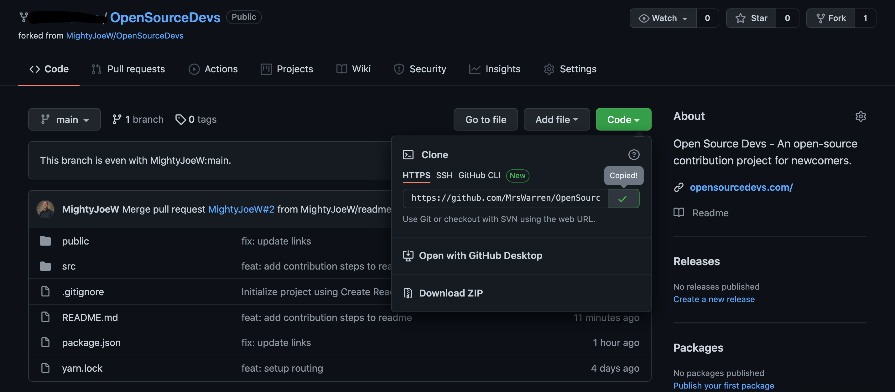
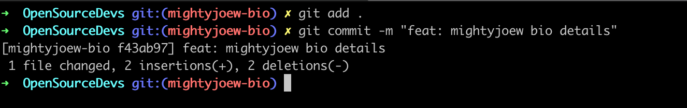

<figure>
  
  <figcaption style="text-align: center">Photographer: <a href="https://unsplash.com/@dmjdenise" target="_blank" rel="noopener noreferrer">Denise Jans
</a></figcaption>
</figure>

<nav>
  <h2>Table of Contents</h2>
  <ul>
    <li>
      <a href="#how-to-find-an-open-source-project">How to Find an Open Source Project</a>
    </li>
    <li>
      <a href="#how-to-run-a-project-locally">How to Run a Project Locally</a>
    </li>
    <li>
      <a href="#how-to-edit-the-code-locally">How to Edit the Code Locally</a>
    </li>
    <li>
      <a href="#how-to-create-a-pull-request">How to Create a Pull Request</a>
    </li>
  </ul>
</nav>

Contributing to open source is an exciting endeavor that is packed with benefits for yourself and the community. Open-source projects allow anyone to utilize their skills and talents to improve a project.

For a brief overview of what open source is along with its benefits and how to get started, check out my previous post <a href="https://www.getscriptordietryin.com/Contributing-to-Open-Source-Where-To-Begin-in-2021/" target="_blank" rel="noopener noreferrer">Contributing to Open Source: Where to Begin in 2021</a>.

If you are ready to contribute to a project but don’t know where to begin, I’ve created the site <a href="https://opensourcedevs.com/" target="_blank" rel="noopener noreferrer">Open Source Devs</a> specifically to encourage newcomers to contribute to open source. This guide will walk you through making a change to the code for your dev info to be featured on the site. If you are not intending on contributing to this project, the process will be the similar for whichever project you chose.

<h2 id="how-to-find-an-open-source-project">How to Find an Open Source Project</h2>

Although you can browse GitHub and check the licenses of projects to learn about the project’s contribution guidelines, a quick way to find open source projects is to search GitHub for the <a href="https://github.com/topics/hacktoberfest" target="_blank" rel="noopener noreferrer">#hacktoberfest topic</a>.

<figure>
  
  <figcaption style="text-align: center">GitHub Hacktoberfest topic</figcaption>
</figure>

This guide will utilize the <a href="https://opensourcedevs.com/" target="_blank" rel="noopener noreferrer">Open Source Devs</a> project to explain the contribution process. If you would like to have a dev card featured on the site, follow the steps below!

<h2 id="how-to-run-a-project-locally">How to Run a Project Locally</h2>

In this guide, I’ll be demonstrating how to make contributions using GitHub and git in the terminal, but GitHub also provides <a href="https://desktop.github.com/" target="_blank" rel="noopener noreferrer">GitHub Desktop</a> which allows you to make contributions without needing to use git or the terminal. Be sure to <a href="https://github.com/join" target="_blank" rel="noopener noreferrer">create a GitHub account</a> so you can follow along.

1. <strong>Fork the project</strong> - To access Open Source Devs in your local environment, navigate to the <a href="https://github.com/MightyJoeW/OpenSourceDevs" target="_blank" rel="noopener noreferrer">Open Source Devs GitHub repository</a> and click the `Fork` button (usually found in the top-right section of the page). Forking a project adds a copy of the project to your GitHub repositories.

<figure>
  
  <figcaption style="text-align: center">Open Source Devs GitHub repo</figcaption>
</figure>

If you have more than one GitHub account or organization, choose which one you want to add this project to.

<figure>
  
  <figcaption style="text-align: center">GitHub fork options</figcaption>
</figure>

After selecting an account, GitHub will begin the forking process (which should only take a few seconds).

<figure>
  
  <figcaption style="text-align: center">GitHub's forking animation</figcaption>
</figure>

<figure>
  
  <figcaption style="text-align: center">Successfully forked project</figcaption>
</figure>

2. <strong>Clone the project</strong> - Next, you need to clone the project to your computer. Click the green `Code` button and copy the url from the field (`https://github.com/MightyJoeW/OpenSourceDevs.git`)

<figure>
  
  <figcaption style="text-align: center">GitHub's clone feature</figcaption>
</figure>

If you decide to use git to handle your contributions locally instead of GitHub Desktop, open your terminal (command line in Windows) and copy the following command to clone the project: `git clone https://github.com/MightyJoeW/OpenSourceDevs.git`

<figure>
  
  <figcaption style="text-align: center">Terminal view of cloning a project</figcaption>
</figure>

3. <strong>Move into the folder</strong> - Now that the project has been downloaded to your computer, you'll need to move into that folder. Use the following command to change directories into the OpenSourceDevs directory: `cd OpenSourceDevs`

<figure>
  
  <figcaption style="text-align: center">Terminal view of changing directories</figcaption>
</figure>

4. <strong>Install the project's dependencies</strong> - Now that you are in the OpenSourceDevs folder, you need to install the project’s dependencies with the following command: `yarn` (if you prefer installing with npm, use `npm install`)

<figure>
  
  <figcaption style="text-align: center">Terminal view of installing a project's dependencies</figcaption>
</figure>

5. <strong>Run the project</strong> - Finally, to run the project to see it in your browser, use the following command: `yarn start` (or `npm start` if you installed with npm).

<figure>
  
  <figcaption style="text-align: center">Terminal view of running the project</figcaption>
</figure>

This project will run in your browser at `http://localhost:3000/`.

_Different projects may have different scripts to run the project, so check the project's `package.json` file and look in the `scripts` object to find the correct start command._

You should see a grid of cards with developer names and links. For this contribution, you will edit a JavaScript object to create a card featuring your GitHub profile info (along with links to your LinkedIn and website if desired).

<figure>
  
  <figcaption style="text-align: center">Open Source Devs UI</figcaption>
</figure>

<h2 id="how-to-edit-the-code-locally">How to Edit the Code Locally</h2>

1. <strong>Create a new branch</strong> - Now that you’ve got the project running, you need to create your own branch to work on. You are currently on the `main` branch which is a protected branch in this project. The code from the `main` branch is what appears on `https://opensourcedevs.com/`, so contributors are not allowed to push directly to it.

To create a new branch, enter the following command into the terminal:
`git checkout -b 'name-of-branch'` i.e. git checkout mightyjoew-bio

<figure>
  
  <figcaption style="text-align: center">Terminal view of creating a branch</figcaption>
</figure>

2. <strong>Add your card info</strong> - In the projects files, navigate to src -> components -> `dev-grid-utils.js` (this is where you’ll add your info to an object). If there are no remaining default objects, copy and paste the final object and replace the values with your own details.

<figure>
  
  <figcaption style="text-align: center">dev-grid-utils.js file for adding new card</figcaption>
</figure>

3. <strong>Stage your changes</strong> Staging your changes essentially determines which files you want to be included in your change. When finished editing your card object, stage your change with the following command: `git add .`

_The period is included as this tells git to stage all of the files you edited._

<figure>
  
  <figcaption style="text-align: center">Terminal view of staging changes</figcaption>
</figure>

4. <strong>Commit your changes</strong> - Changes need to be commited with a message before pushing back up to GitHub, so create a commit message using the following command structure:
   `git commit -m "feat: description of change"`

   i.e. `git commit -m "feat: mightyjoew bio details"`

<figure>
  
  <figcaption style="text-align: center">Terminal view of committing changes</figcaption>
</figure>

5. <strong>Push your changes to GitHub</strong> - Push your changes up to GitHub with the following command: `git push origin name-of-branch`

i.e. `git push origin mightyjoew-bio`

<figure>
  
  <figcaption style="text-align: center">Terminal view of pushing changes with git push</figcaption>
</figure>

<h2 id="how-to-create-a-pull-request">How to Create a Pull Request</h2>

1. <strong>Create a pull request</strong> - In GitHub, you’ll need to create a pull request. A pull request is a request for your change to be added to the original project.

When you go to your forked version of OpenSourceDevs on GitHub, you should see a banner at the top with a green button that says `Compare & pull request`. Clicking on this button will begin the pull request process.

<figure>
  
  <figcaption style="text-align: center">Creating a pull request in GitHub</figcaption>
</figure>

If you do not see this banner, click on the `Pull requests` tab and click on the green `New pull request` button (be sure to change the `compare` branch to your branch name to point to `base: main`).

2. <strong>Provide details about your changes</strong> - Give your pull request a title and add a description of what the change is. If you want this to count towards the `#hacktoberfest` challenge, click the gear icon next to Labels to add the `hacktoberfest` label (if you’re unable to edit Labels, I’ll add it for you). _#hacktoberfest pull requests only count towards the challenge in October._

<figure>
  
  <figcaption style="text-align: center">Adding pull request details</figcaption>
</figure>

3. <strong>Submit the pull request</strong> - Click the green `Create pull request` button.

At this point, the project maintainer will review your pull request. If everything looks good, the maintainer will approve and merge your code. If the maintainer has any feedback, they’ll leave a comment on your pull request which you can respond to. If a code change is needed, you can go through the process above to make the change locally and push it to your branch again.

Lastly, your branch may have merge conflicts if you and another dev made changes in the same block of code in a file. In this scenario, the conflict needs to be resolved. If your branch has conflicts, you can use the web editor or command-line options under `This branch has conflicts that must be resolved to resolve the conflicts`.

<figure>
  
  <figcaption style="text-align: center">Pull request with conflicts</figcaption>
</figure>

Congratulations! You are now an open-source contributor 🎉

<em>If you got stuck anywhere in the process or want to celebrate submitting a pull request, reach out to me on <a href="https://www.linkedin.com/in/josephmwarren/" target="_blank" rel="noopener noreferrer">LinkedIn</a> or leave a comment below</em>. Also, I recommend plugging into the <a href="https://dev.to/devteam/hacktoberfest-2021-is-here-4a3l" target="_blank" rel="noopener noreferrer">#hacktoberfest</a> community on dev.to for additional help and support.
