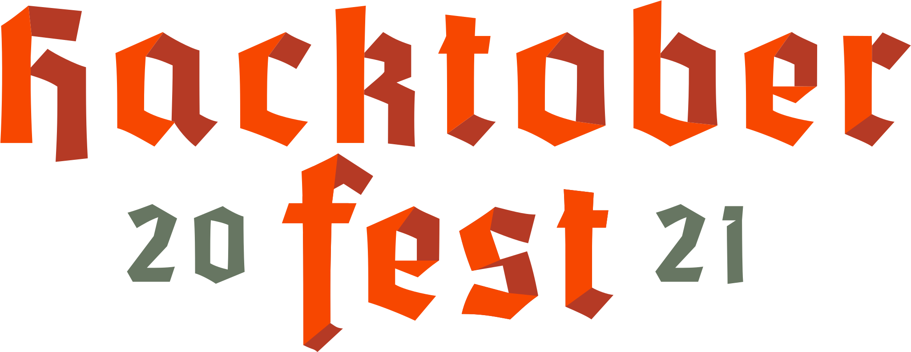

<figure>
  
</figure>

Digital Ocean’s <a href="https://pages.github.com/" target="_blank" rel="noopener noreferrer">Hacktoberfest</a> is an annual celebration that encourages participation in open source projects. As a long-time contributor, I decided to experience the other side as a project maintainer for #Hacktoberfest2021. Maintaining an open-source project comes with a multitude of responsibilities and unexpected occurences, and here are seven suggesstions to make your project-maintaining process as smooth and effective as possible.

New to open source? I’ve written a few articles to explain what open source is, how to contribute, and why community is so crucial in software development.\*

- <a href="https://www.getscriptordietryin.com/Contributing-to-Open-Source-Where-To-Begin-in-2021/" target="_blank" rel="noopener noreferrer">Contributing to Open Source: Where to Begin in 2021</a>
- <a href="https://www.getscriptordietryin.com/contributing-to-open-source-starter-guide/" target="_blank" rel="noopener noreferrer">Contributing to Open Source Starter Guide</a>
- <a href="https://www.getscriptordietryin.com/5-Career-Benefits-Community-Provides-To-Software-Developers/" target="_blank" rel="noopener noreferrer">5 Career Benefits Community Provides to Software Developers</a>

## Decide on Your Time Commitment

Maintaining an open-source project can require a great deal of time and effot. For an actie project, duties include reviewing code, leaving comments on pull requests, answering questions, monitoring issues, testing changes, and more.

If you were the original creator of the codebase, it also took time to plan out and build the project, make archetiectual decisions, create documentation for contributors, set up hosting and deployment, etc.

Within a one-week span, the <a href="https://github.com/MightyJoeW/OpenSourceDevs" target="_blank" rel="noopener noreferrer">Open Source Devs project</a> accumulated 17 pull requests from 15 different authors for a total of 19,454 code additions!

<figure>
  
  <figcaption style="text-align: center"><a href="https://github.com/MightyJoeW/OpenSourceDevs/pulse" target="_blank" rel="noopener noreferrer">Open Source Devs Contributions
</a></figcaption>
</figure>

Needless to say, the time I was spending with the project rapidly increased. I started waking up earlier and putting in time on weekends to provide code reviews and add fixes.

It would be in your best interest to decide how much time you’d be comfortable dedicating to a side project. You don’t want to feel stressed or experience burn out while attempting to handle an influx of pull requests.

Speaking specifically about #hacktoberfest, contributors may unintentionally put pressure on you to approve their code as they’re hoping to get their 4 pull requests to complete the challenge. Don’t allow that pressure to guilt you into working crazy hours to provide speedy feedback. Your mental and physical health are more important.

## Recruit Maintainers

As you’re thinking about what time commitment you will be comfortable with, it is also a good idea to think about prospects that can join you in maintaining the project. If your project continues to grow, it will become difficult to handle evertying on your own.

Work your connections to gauge interest for joining you in maintaining the project. Also, reach out to repeat contributors to see if they have any interest in being a maintainer. Be understanding if someone doesn’t have the time (or interest) in becoming a maintainer, but don’t allow that possibility to prevent you from at least checking.

## Provide Contribution Guidelines and Documentation

First and foremost, your codebase and community will benefit from a descriptive README file. Your README file will includes information such as what the project is, how to run it locally, how to contribute, and how to submit issues. To show appreciation for your contributors, feel free to also include a link to the project’s contributors page along with a thank you. If you don’t want to get to detailed in your README, you can also create a contribution file or a Wiki.

Next, you’ll want to consider including a code of conduct to establish acceptable and unacceptable behavior from contributors. GitHub provides a <a href="https://docs.github.com/en/communities/setting-up-your-project-for-healthy-contributions/adding-a-code-of-conduct-to-your-project" target="_blank" rel="noopener noreferrer">guide</a> that make it easy to set this up (templates included).

In addition to a code of conduct, include a license that explains how your project can be used by others. GitHub also provides license templates with MIT being a good standard template for projects. GitHub's icense creation guide is accessible <a href="https://docs.github.com/en/communities/setting-up-your-project-for-healthy-contributions/adding-a-license-to-a-repository" target="_blank" rel="noopener noreferrer">here</a>.

On a technical level, feel free to provide however much detail you want contributors to be aware of. For example, if you are using formatters such as Prettier and ES Lint, let contributors know what your style rules are. Later, we will get into setting up automated formatting with husky to create consistent styling in pull requests.

The more guidance you can provide the better as you can prevent contributors from bringing in libraries for a solution when the project already has something in place. Newcomers will learn from your standards, vets will appreciate the structure being in place, and You’ll create less work for yourself.

Lastly, be explicit if there is something you’d like your contributors to do. If you’d like contributors to star your project, simply ask. It’s a small gesture that many contributors won’t mind doing but may not have been thinking about when making changes to the project.

## Automate Processes

Automation will become your best friend while maintaining a project. Below is a list of automation techniques that will save you a ton of time.

- Format code automatically. Automated formatting creates consistent code formatting in pull requests. Husky is a usfeul npm package which enables precommit hooks i.e. you can setup lint and prettier to run automatically when committing code. Those using create-react-app can setup Husky with the steps <a href="https://create-react-app.dev/docs/setting-up-your-editor/#formatting-code-automatically" target="_blank" rel="noopener noreferrer">here</a>.
- Track progress with GitHub projects. - Github Projects provide Kanban templates with automation features i.e. new issues get automatically added to a Todo column, new pull requests automatically get added to a In Progress column. Items move onto review columns and eventuall the done column as actions are taken on the pull request.
- Implement automatated code analysis with Deepsource. When actiating a project on Deepsource, a list of potential problem with your code will be created. With the click of a button, you can create an issue on GitHub. There is also an auto-fix feature, but I wouldn’t recommend it for a hacktoberfest project as it would take opportunities away from contributors.

<figure>
  
  <figcaption style="text-align: center"><a href="https://opensourcedevs.com/" target="_blank" rel="noopener noreferrer">Deepsource issues
</a></figcaption>
</figure>

- Create pull request templates. Pull Request templates encourage descriptive and helpful PR’s and saves time by preventing contributors from having to fill out a PR from scatch. Also, a template prevents PRs from having empty, non-helpful descriptions. For help, follow GitHub's PR template creation guide <a href="https://docs.github.com/en/communities/using-templates-to-encourage-useful-issues-and-pull-requests/creating-a-pull-request-template-for-your-repository" target="_blank" rel="noopener noreferrer">here</a>.
- Create issue templates. Just like pull request templates, issue templates encourage contributors to provide useful information in regards to the issue they discovered. For help, follow GitHub's PR template creation guide <a href=https://docs.github.com/en/communities/using-templates-to-encourage-useful-issues-and-pull-requests/configuring-issue-templates-for-your-repository>here</a>.
- Create a checklist. Specifically with something like hacktoberfest, include a checkbox to add the hacktoberfest-accpeted label to ensure contributors don’t lose out on gaining an accepted pull request.

## Track Sessions with Analytics

If you have a site or app and are interested in tracking how many users are hitting your pages, you will want to setup analytics ahead of time. GitHub provides an Insights tab which is packed with analytics for your codebase, but you’ll need to take an extra step to know how many users are hitting your actual site.

<figure>
  
  <figcaption style="text-align: center">Google Analytics Example</figcaption>
</figure>

Google Analytics is a popular free option in which I’ve personally used via <a href="https://github.com/react-ga/react-ga" target="_blank" rel="noopener noreferrer">react-ga</a>. If your project is on Netlify, you have the option of utilizing their <a href="https://app.netlify.com/sites/opensourcedevs/analytics" target="_blank" rel="noopener noreferrer">analytics</a>. Netlify’s analytics is $9, but it doesn’t require the code changes needed to implement Google Analytics.

## Adjust Notification Settings

If your project ends up with a lot of activity, your email will become flooded with notifications. Decide ahead of time what all you want notifications for and if you want notifications going to your personal email address or an email address that is dedicated to the project. Also, keep in mind that you can opt to receive web and mobile notifications if you don’t want your inbox flooded.

<figure>
  
</figure>

Like most configuration settings, you can tweak your notification settings as you progress and gain a better understanding of your personal notification preferences.

<figure>
  
  <figcaption style="text-align: center">GitHub notification preferences</figcaption>
</figure>

## Promote Your Project Tactifully

For your project to attract contributors, you’ve got to put your project in front of the right eye balls. The challenge, though, is sharing without venturing into spamming territory.

Firstly, if your content is useful, figure out how to best articulate how others can benefit from contributing to the project. Then, you need to find where those people hang out. Specifically with #hacktoberfest, there are communities dedicated to the project with spaces to share your project.

- `Dev.to` hacktoberfest <a href="https://dev.to/devteam/hacktoberfest-2021-is-here-4a3l" target="_blank" rel="noopener noreferrer">main page</a>
- Hacktoberfest <a href="https://discord.gg/hacktoberfest" target="_blank" rel="noopener noreferrer">Discord server </a>
- Hacktoberfest <a href="https://www.reddit.com/r/hacktoberfest/" target="_blank" rel="noopener noreferrer">subreddit</a>
- Social media posts with the #hacktoberfest hashtag

<figure>
  
  <figcaption style="text-align: center">Open Source Devs Posts</figcaption>
</figure>

I previously wrote about the importance and <a href="hhttps://www.getscriptordietryin.com/5-Career-Benefits-Community-Provides-To-Software-Developers/" target="_blank" rel="noopener noreferrer">benefits of community</a> , and community that you’ve built up rapport with will typically be accepting of useful content that you’d like to share. And as always, feel free to utilize your social media accounts to share your content. Just be sure to have the suggestions above in place to be ready when the contributions start coming in 😎

<em>Questions? Leave a comment below or <a href="https://www.linkedin.com/in/josephmwarren/" target="_blank" rel="noopener noreferrer">connect with me on LinkedIn</a>!</em>
