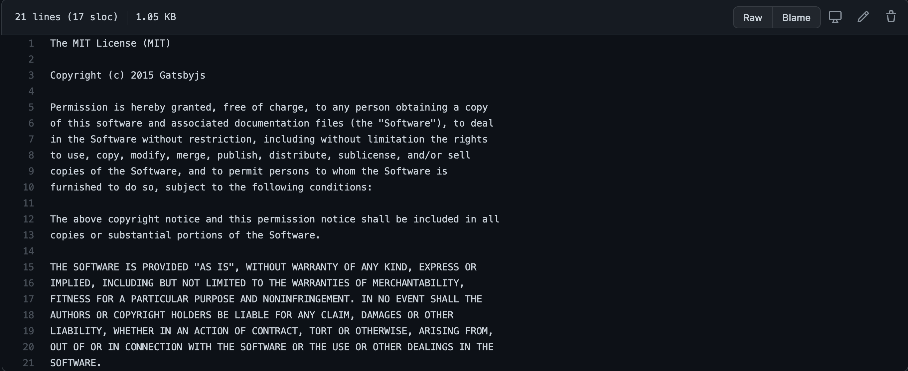

<figure>
  
  <figcaption style="text-align: center">Photographer: <a href="https://unsplash.com/@marvelous" target="_blank" rel="noopener noreferrer">Marvin Meyer
</a></figcaption>
</figure>

One of the most common pieces of advice given to job-seeking developers is to contribute to open-source projects. Contributing to open-source projects provides an array of career growth opportunities including learning how to navigate a new codebase, working in a team environment, building useful features for the community, and generating legitimate resume & portfolio content.

That sounds awesome! But where do you start? How does one go about finding an open-source project and actually making a meaningful code change? Let’s explore what open source is and the many ways one can get involved.

##What Is Open Source?
Opensource.com defines open source as “something people can modify and share because its design is publicly accessible” and open source software as “software with source code that anyone can inspect, modify, and enhance.”

As a consumer, open-source projects allow you to download and use products for free. There is a chance you’ve heard of or used open source software like the following:

- LibreOffice (a Microsoft Office alternative)
- Firefox (web browser)
- Audacity (audio software)
- FileZilla (file transferring application)
- BitWarden (password manager)

Open-source software comes with licenses that can be viewed in the project where the code lives (oftentimes on GitHub). It’s a good idea to check out each project’s license, but most are constructed in a way that allows the sharing, accessing, and modifying of the code.

<figure>
  
  <figcaption style="text-align: center">MIT License</figcaption>
</figure>

##Where to Begin
Two common roadblocks with contributing to open source relate to not feeling skilled enough to make a meaningful contribution or not knowing how to actually get involved.

You may be surprised at how qualified you are to make contributions right now. For example, my first contribution was fixing typos. I felt like my little pull requests were insignificant, but two major things transpired.

1.  I got my first experience forking a project outside of my web development bootcamp, submitting a pull request, and having my code reviewed and merged into a project.
2.  I was able to help out on a project I cared about. Although my fixes were not resolving a technical bug or building a new feature, the typo fixes still enhanced the presentation and overall experience of the site.

Digital Ocean’s Hacktoberfest is a great place to start. Every October, Hacktoberfest celebrates and encourages participation in open source projects. The initiative welcomes devs of all skill levels, and provides suggestions of projects to contribute to. After completing 4 approved pull requests, you can receive some nice swag including laptop stickers and a T-shirt!

<figure>
  
  <!-- <figcaption style="text-align: center">Hacktoberfest</figcaption> -->
</figure>

If you look through the suggestions and still are unsure where to begin, you can add the `hacktoberfest-accepted` label on one of your projects. Creating pull requests for your own project with this label project can count toward the 4 needed to complete the challenge.

For the 2020 Hacktoberfest, I created an open-source project for my wife and me to collaborate on while she was learning to code. The web app displays 10 articles every day highlighting blacks in technology and business, and the code base is accessible <a href="https://github.com/teamwarren/blacktechdaily" target="_blank" rel="noopener noreferrer">here
</a> if you want to contribute.

For more technical details on how to contribute to an open-source project, check out freeCodeCamp’s <a href="https://github.com/freeCodeCamp/how-to-contribute-to-open-source" target="_blank" rel="noopener noreferrer">open-source repo
</a> . GitHub also has a robust guide for <a href="https://opensource.guide/how-to-contribute/" target="_blank" rel="noopener noreferrer">getting started
</a>.

<em>Confused on where to begin or wanting to share what you'll work on this month? Leave a comment below or <a href="https://www.linkedin.com/in/josephmwarren/" target="_blank" rel="noopener noreferrer">connect with me on LinkedIn</a>!</em>
