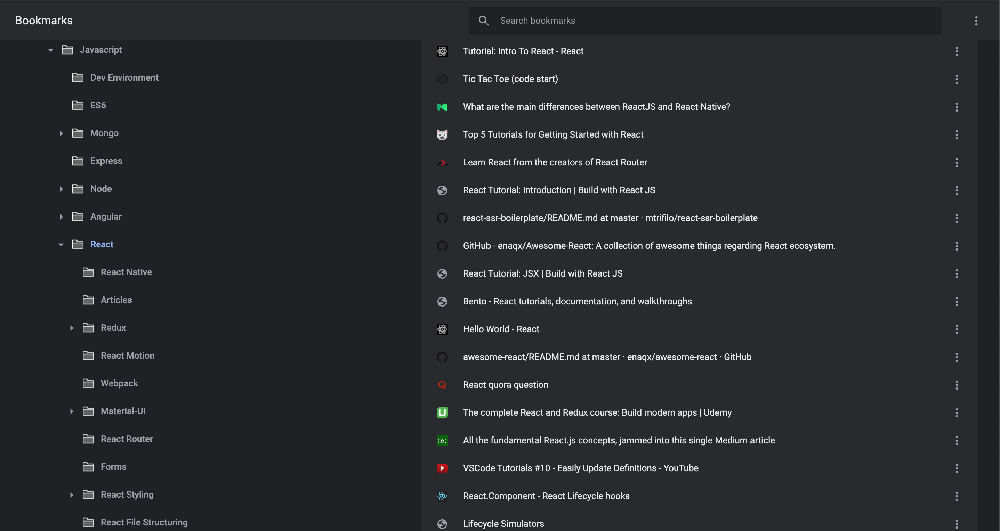
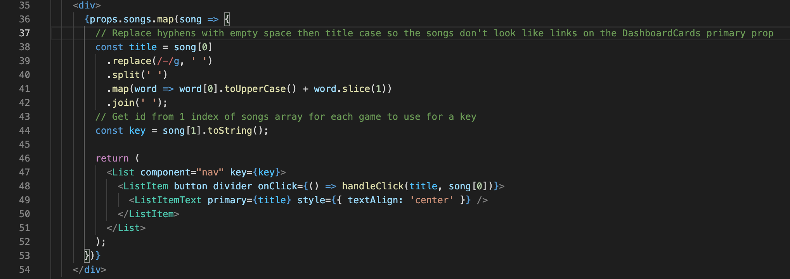

<figure>
  
  <figcaption style="text-align: center">Photographer: <a href="https://unsplash.com/@0asa" target="_blank" rel="noopener noreferrer">Vincent Botta</a></figcaption>
</figure>

Have you ever known someone who can ace tests without studying? Do you have friends that can recall details of movies that they’ve only seen once many years ago?

It wasn’t until I’ve encountered people with this remarkable ability to instantaneously recall information that I realized how differently people’s memories work. I used to get frustrated by not being about to recall details on the spot. Specifically, with code, I’ve had people ask me about a line of code or functionality that was created many months (or even years) ago.

This generated stress for a season, but what I perceived as a weakness became a strength when I started to employ the following techniques in my daily and work lives.

##Repetition and Consistency > Memorization
I realized early on in my coding journey how crucial repetition and consistency is when attempting to improve a skill. Early on, it felt like I was diving into an endless abyss of new terms and processes. I was taking notes abundantly, but I found myself questioning how I could possibly memorize a notebook worth of foreign concepts.

The daily training, though, fueled heavily by my participation in <a hred="https://www.100daysofcode.com/" target="_blank" rel="noopener noreferrer">#100DaysOfCode</a> led to concepts sticking overtime. Eventually, repetition creates muscle memory which enables a task to become second nature. With this knowledge, it is imperative to not get frustrated when a new concept doesn’t click immediately.

In full transparency, I went through an entire web development boot camp without understanding how to actually use props in React (if you’re unfamiliar with React, using props is one of the most basic concepts which allow you to pass data around your app). Similarly, it wasn’t until a year after initially being taught Redux that it finally clicked.

With Redux being just another tool in my tool belt, I can always pull on that experience as a reminder to give things time and practice regularly. Concepts that I couldn't quite understand or remember naturally sank in over time.

##Browser Bookmarks
I don’t where I would be without bookmarks! Any site that I feel I may want to revisit in the future is added to my bookmarks. In the past, I spent a good deal of time organizing my bookmarks into logical folders.

<figure>
  
  <figcaption style="text-align: center">Chrome Bookmarks</figcaption>
</figure>

These days, I tend to just add any bookmark directly to my main bookmarks bar and utilize the search feature to quickly find what I need. Similarly, adding events to your calendar is a <em>must</em>. Seriously, I wonder how many meetings I would have missed without utilizing calendar events & notifications.

##Code Comments
This is one of the hot coding debates that I’d rank up there with tabs vs. spaces or test-driven development vs. after-the-fact testing. Code that is commented out is ignored by compilers and interpreters. Therefore, comments provide a way for developers to add notes and annotations in their code to provide an explanation of what’s happening.

If you don't have the best memory, you may be more in favor of utilizing comments that explain what’s happening. Seemingly simple code can feel foreign after not working with it for awhile, and comments speed up the process of remembering what the code is supposed to do.

<figure>
  
  <figcaption style="text-align: center">The lines preceded by <code>//</code> are notes to myself</figcaption>
</figure>

The argument against comments is the belief that your code should be self-documenting. In order words, your code should be written in a clean, organized manner with self-explanatory variables & function names, visually appealing formatting, etc. Code comments alert some developers that the code may not be well-written nor easily maintained.

I feel there is some validity to this mindset as it challenges you to be more thoughtful about how you design and structure your code: But at the end of the day, it’s more beneficial to my productivity to include helpful comments to provide more context. I do utilize less comments in codebases for work to keep the code consistent based on how the team approaches comments, but I comment freely in my own personal projects.

Good unit tests can also provide great documentation for your code. Test cases with accurate titles that cover expected behavior throughout your code could serve as a good way for someone new to a project (or file) to understand the code's intended functionality.

##Notes & Documentation
As someone who struggles to recall information at times, note-taking is about as essential as air and food. I would highly suggest developing an effective process for taking notes. You want your notes to be organized and searchable.

Beyond personal notes, writing articles and blog posts generate an incredible learning resource for yourself and others. Articles and blogs are more time-consuming than notes, but they provide a more aesthetically-pleasing document.

On another note, blog posts and articles can also help you land a job. I, along with multiple friends in this field, have personal testimonies of how our blog posts impressed our soon-to-be employer.

##Active Listening

<figure>
  
  <figcaption style="text-align: center">Photographer: <a href="https://unsplash.com/@ericmok" target="_blank" rel="noopener noreferrer">Erik Mok</a></figcaption>
</figure>
I learned about active listening when working in the life-coaching space years ago, and it is as relevant as ever in this field. With the number of meetings you can find yourself in, it’s easy to get distracted or to multitask. This creates an obvious issue as you are going to miss out on details throughout a call or planning session.

I am guilty of picking up this bad habit of multitasking in meetings, and it takes effort to shut everything out to focus on what is being discussed. Active listening includes paraphrasing & reflecting back on what is being said, and this can be combined with note-taking to help remember important information long-term.

##Health & Wellness

<figure>
  
  <figcaption style="text-align: center">Photographer: <a href="https://unsplash.com/@judebeck" target="_blank" rel="noopener noreferrer">Jude Beck</a></figcaption>
</figure>

Last but certainly not least, it’s essential to take care of your health. Sleeping, drinking plenty of water, eating right, and exercising does wonders for your productivity as well as your memory.

It’s said often, but there is also power in taking breaks. I can’t explain what is happening from a scientific perspective, but more times than not, stepping away from a problem for some time seems to be the secret sauce of figuring it out. This “fresh brain” can produce new ideas as well as pull past experiences to the forefront that can help at this moment.

Last but certainly not least, be sure to take care of your mental health as well. Various employers and churches offer free counseling sessions and resources.

As you can see, having a weakness should not deter you from pursuing a passion. Teammates regularly contact me for information because they know I have notes or a link saved somewhere!

It may seem unfathomable to delve into the world of software development if you feel you don’t have a great memory, but if you use the many tools and processes at your disposal, you can thrive beyond anything you can imagine.

Especially if you decide to create publically-available content, you are now giving back by helping others learn from your experiences and expertise.

<em>Leave a comment below if you have any thoughts, comments, or questions. Also, feel free to <a href="https://www.linkedin.com/in/josephmwarren/" target="_blank" rel="noopener noreferrer">connect with me on LinkedIn</a>.</em>
